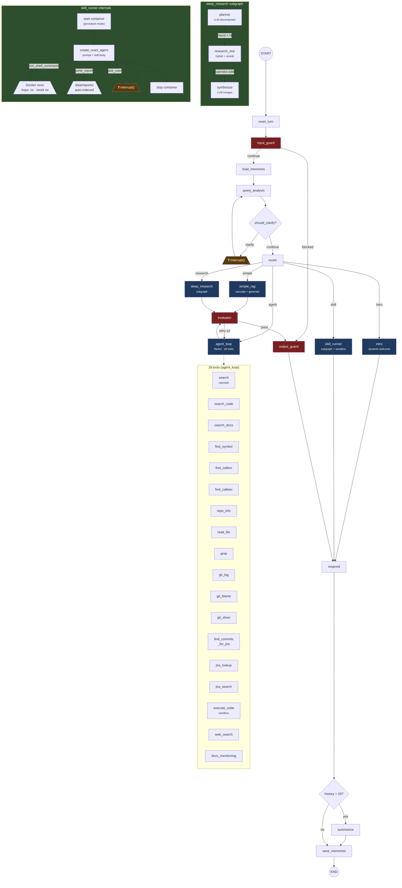

# Code / Trace / Origin

### From signal to source — cited to the line.

---

## The Problem

Your engineering knowledge lives in **5 silos**:

| Silo | What's there | How you search it today |
|---|---|---|
| **Code** | The implementation — _what_ exists | grep, IDE find, Copilot (one file at a time) |
| **Docs** | Design docs, runbooks, Confluence — _why_ it was built | keyword search, stale links |
| **Issues** | JIRA tickets — _intent_ and _status_ | JQL, context-switch to browser |
| **Logs** | Runtime telemetry — _what happened_ | Splunk/Grafana, copy-paste to Slack |
| **Git** | Change history — _who/when/why_ it changed | `git log --grep`, blame, manual cross-ref |

The answer to any real question — _"why is this service timing out?"_ — **spans all five**. Today that's 4 tabs, 3 tools, and a Slack ping to the person who left last quarter.

---

## What CTO Does

**C**ode · **T**race · **O**rigin — one agent across all five sources.

> Not _"I think auth works like X"_
>
> Instead: _"auth is enforced in `SSLContextProviderImpl.java:47` [1], configured via `application.yml:12` [2], changed in commit `a1b2c3d` for PROJ-4567 [3]"_

- **Code** → indexed, AST-chunked, call-graphed
- **Trace** → git history live (blame/log/show), JIRA live (lookup/JQL), Phoenix spans _(runtime: next phase)_
- **Origin** → every answer cited to the exact source; the provenance chain is the product

---

## Architecture

```
 Sources (live, on-prem)              Orchestration                  Surfaces
┌─────────────────────┐     ┌────────────────────────────┐    ┌──────────────┐
│ Git repos (indexed)  │     │ LangGraph 18-node graph     │    │ Web UI (/ui)  │
│ Confluence (24h Δ)   │────▶│                             │───▶│ CLI (cto)     │
│ JIRA (live lookup)   │     │ route → simple | agent |    │    │ REST/SSE API  │
│ Local docs (PDF/MD)  │     │         research | skill    │    │ Phoenix trace │
│ Skill containers     │     │                             │    └──────────────┘
└─────────────────────┘     │ 18 tools · rerank · eval ·  │
                             │ guards · cache · memory     │
        Corp LLM Gateway     └────────────────────────────┘
     (Claude / GPT / Gemini)         ▲
              ▲                      │
              └──────────────────────┘
                  All on-prem · no SaaS
```

---

## The Agentic Graph — nodes, subgraphs, tools



**18 nodes** · **2 subgraphs** · **18 tools** · **5 routes** · PostgresSaver checkpointed · Phoenix-traced

---

## Retrieval — structurally aware

| Layer | What |
|---|---|
| **Hybrid search** | Dense (1024-dim) + BM25 sparse, fused via RRF |
| **Tiered cascade** | Code → Docs → Confluence; early-exit on strong hits |
| **Cross-encoder rerank** | `bge-reranker-v2-m3` (local, no API) |
| **Code call-graph** | Postgres recursive CTEs — `find_callers`, `find_callees` |
| **AST chunking** | tree-sitter for 10 languages; per-symbol named chunks |
| **Live tools** | git log/blame/show, JIRA lookup/JQL — no index lag |

---

## Routing — the right strategy per question

| Query type | Route | Strategy |
|---|---|---|
| "what can I do here?" | **intro** | Dynamic welcome, zero LLM |
| "explain auth flow in X" | **simple** | Single retrieve → generate |
| "where is X defined, who calls it" | **agent** | ReAct loop, 18 tools |
| "compare auth in A vs B" | **research** | Parallel fan-out, synthesize |
| "run security audit on X" | **skill** | Multi-phase playbook + sandbox |

---

## Skills — pluggable multi-step playbooks

A **skill** = a markdown file with:
- Frontmatter: triggers, sandbox config, allowed tools, max_iter
- Body: the system prompt (phases, instructions)

**No code changes to add a new skill.**

| Skill | Mode | What it does |
|---|---|---|
| `onboarding-tour` | no sandbox | Walk a new engineer through a repo |
| `security-audit` | persistent container | 10-phase scanner sweep + scored report |

---

## Security Audit — in action

```
⏺ skill security-audit [persistent] repo=acme-mobile cid=cto-skill-a1b2…
⏺ run_shell_command(secaudit-versions)
⏺ run_shell_command(gitleaks detect --source /repo --no-git…)
  ⎿  {"exit_code": 0, "stdout": "[\n  {\"RuleID\": \"generic-api-key\"…
⏺ run_shell_command(semgrep --config p/owasp-top-ten --json /repo)
  ⎿  {"exit_code": 0, …}
⏺ write_report(repo='acme-mobile', content='## Phase 3 — Secrets…', append=True)
  ⎿  Saved: reports/acme-mobile/2026-06-04-security-audit.md (2,847 bytes)
…
Score 6.4/10 · 2 CRITICAL · 8 HIGH · 14 MEDIUM · 22 LOW
```

Report is auto-indexed → follow-up: _"what were the CRITICAL findings?"_

---

## Safety & Trust

| Layer | How |
|---|---|
| **Citations** | Every `[SOURCE_N]` verified against retrieved chunks |
| **Self-correction** | Evaluator retries weak answers (≤2 loops) |
| **Honest abstain** | Won't guess when retrieval is below threshold |
| **Input guard** | PII redaction, jailbreak/off-topic block pre-LLM |
| **Output guard** | Secret scrub, orphan-citation flag, relatedness bands |
| **Sandbox** | `--cap-drop=ALL`, `/repo:ro`, no host exec ever |
| **Auth** | Bearer keys, OIDC/oauth2-proxy, Gradio login |
| **Observability** | Phoenix: full span tree for every query |

---

## Surfaces

| | |
|---|---|
| **Web UI** | Drag-drop screenshots/logs → OCR/vision. Multi-turn. |
| **CLI** | Claude-Code-style ⏺/⎿ trace. `--remote` thin client (3 deps, no torch). |
| **REST/SSE** | `POST /query` streaming. Auth-gated. |
| **Cache** | Semantic. Sub-second on repeat questions. |

---

## Live Demo

---

### 1 · "What can I do here?"

**Shows:** instant dynamic intro — lists your repos, skills, live tools.

_Route: intro · <1s · zero LLM_

---

### 2 · "Where is validateCSR defined?"

**Shows:** code-graph precision — exact file:line, not fuzzy search.

_Route: agent · `⏺ find_symbol` · ~8s_

---

### 3 · "Who calls validateCSR?"

Then follow up: **"and where is _that_ called?"**

**Shows:** recursive callers + multi-turn context (resolves "that" from history).

_Route: agent · `⏺ find_callers` · ~10s_

---

### 4 · "How is mTLS defined in acme-api?"

**Shows:** full agent ReAct — search → grep → read_file → cited answer.

_Route: agent · 4-6 tools · ~15s_

---

### 5 · "Explain auth in mgmtapi"

**Shows:** human-in-the-loop — ❓ "which mgmtapi?" → pick → resumes.

_Route: agent (after clarify) · interrupt/resume_

---

### 6 · "Compare JWT handling in acme-api vs acme-auth"

**Shows:** deep research — parallel per-repo branches, comparison table.

_Route: research · `Send` fan-out · ~15s_

---

### 7 · "Who last changed the auth config in acme-api and why?"

**Shows:** cross-source join — git blame → commits → JIRA ticket → the _why_.

_Route: agent · git + JIRA tools_

---

### 8 · _(Drop a screenshot into the input box)_ "What's causing this?"

**Shows:** image attachment — OCR/vision extracts text, agent searches the codebase.

_MultimodalTextbox · 📎 chip · vision fallback_

---

### 9 · "/onboarding-tour acme-api"

**Shows:** skill execution — live tool-call trace, `write_report(append=True)` per section, saved to `data/reports/`.

_Route: skill · ~2-3 min · no sandbox needed_

---

### 10 · "Where is validateCSR defined?" _(again)_

**Shows:** semantic cache hit in <1s. Then click 🔍 trace → Phoenix span tree.

_⚡ cached (sim=1.00) · Phoenix deep-link_

---

## Bonus: the report loop closes

After the security audit, ask:

> "What were the CRITICAL findings in the acme-mobile security audit?"

→ The report was **auto-indexed**. CTO answers from it like any doc.

---

## Tech Stack

| Layer | Technology | Role |
|---|---|---|
| **Orchestration** | LangGraph (StateGraph, Send, interrupt, PostgresSaver) | 18-node graph, checkpointed multi-turn, parallel fan-out |
| **Retrieval** | Qdrant (dense + BM25 sparse, RRF fusion) | Hybrid vector search, tiered cascade |
| **Reranking** | bge-reranker-v2-m3 (local cross-encoder) | Precision without API cost |
| **Chunking** | tree-sitter (10 languages + HCL/Terraform) | AST-aware, per-symbol named chunks |
| **Code graph** | Postgres (recursive CTEs, `code_symbols`/`code_edges`) | Callers/callees across repos |
| **LLM gateway** | LiteLLM (corp-hosted) → Claude / GPT / Gemini | No vendor lock-in; stays on-prem |
| **Observability** | Phoenix + OpenInference (OTel auto-instrument) | Full span tree per request |
| **API** | FastAPI + SSE streaming | Real-time tool-call events to clients |
| **Web UI** | Gradio 6 (MultimodalTextbox, drag-drop, dark mode) | Zero-install browser access |
| **CLI** | rich + prompt_toolkit (`cto` binary, `--remote` thin client) | Claude-Code-style ⏺/⎿ trace |
| **Sandbox** | Docker (two-mode: ephemeral `--rm` / persistent per-skill) | Scanners run, host stays isolated |
| **Connectors** | Confluence (24h version-diff), JIRA (live REST), git (subprocess) | Multi-source without copying |
| **Auth** | Bearer keys, oauth2-proxy (OIDC), Gradio login | Layer-1 today; OIDC upgrade path ready |
| **Caching** | Qdrant semantic cache (1024-dim cosine, TTL) | Sub-second on repeat questions |

---

## What's Next

| Phase | Focus |
|---|---|
| **Skill expansion** | More playbooks: dependency-audit, terraform-plan, incident-postmortem, release-notes |
| **Code generation** | Worktree-isolated PR-only writes (the line moves from "never writes" to "writes via PR for human review") |
| **MCP server** | Expose CTO's tools to IDE/editor agents |
| **Per-user ACLs** | GitLab project membership → retrieval filter |
| **Go CLI binary** | Single static binary, cross-platform, zero Python on the laptop |

---

## Summary

| | Before CTO | After CTO |
|---|---|---|
| "Where is X?" | 15 min grep + Slack ping | 8 seconds, cited |
| "Why was this changed?" | JIRA + git + Confluence + asking | One query, cross-source |
| "New hire tour" | Week 1 tribal knowledge | `/onboarding-tour` → day-1 doc |
| Security posture | Quarterly, manual | `/security-audit` → scored report, any time |
| Accuracy | "I think…" / hallucination risk | Cited + self-graded + honest abstain |

---

_Code / Trace / Origin — from signal to source, cited to the line._
