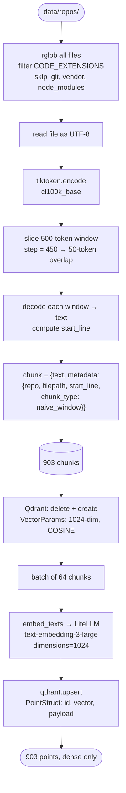
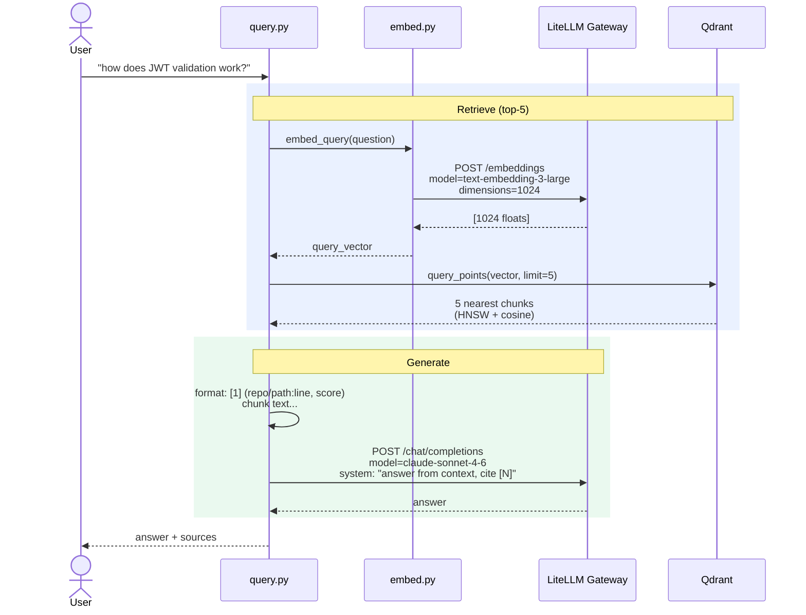
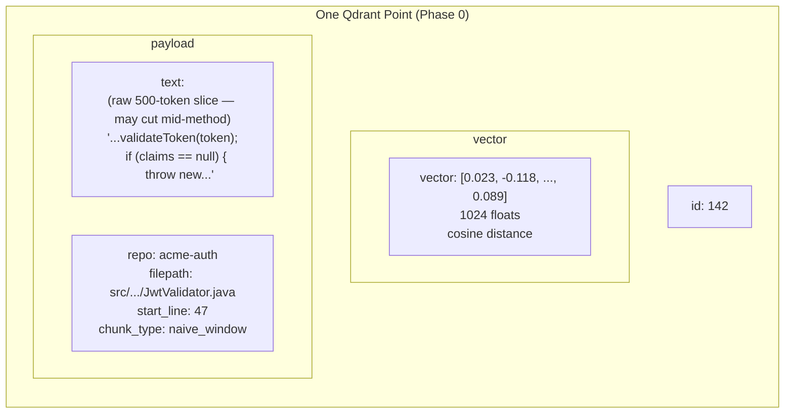
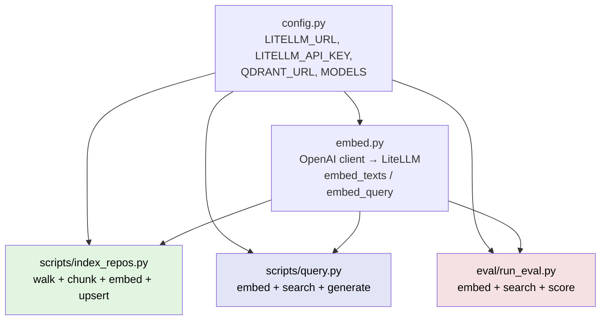

# Phase 0 — Architecture & Code Flow

> Baseline RAG: naive chunking, dense-only vectors, no reranker. Establishes the eval baseline every later phase must beat.

## 1. System Architecture

```mermaid
flowchart LR
    subgraph Sources
        repos[(data/repos/<br/>acme-auth<br/>acme-api)]
    end

    subgraph Indexing["Indexing (offline)"]
        idx[scripts/index_repos.py]
        chunk[chunk_text<br/>500-token windows<br/>50-token overlap]
        emb[embed.py]
    end

    subgraph External
        litellm[LiteLLM Gateway<br/>corp LiteLLM proxy]
        embModel[[text-embedding-3-large]]
        claude[[claude-sonnet-4-6]]
    end

    subgraph Storage
        qdrant[(Qdrant<br/>collection: code<br/>dense only, cosine)]
    end

    subgraph Query["Query (online)"]
        q[scripts/query.py]
        ret[retrieve<br/>cosine top-5]
        gen[generate_answer]
    end

    subgraph Eval
        ev[eval/run_eval.py<br/>recall@k, keyword recall]
        gs[(golden_set.jsonl)]
    end

    repos --> idx
    idx --> chunk
    chunk --> emb
    emb --> litellm
    litellm --> embModel
    idx --> qdrant

    q --> ret
    ret --> emb
    ret --> qdrant
    ret --> gen
    gen --> litellm
    litellm --> claude

    gs --> ev
    ev --> emb
    ev --> qdrant
```

## 2. Indexing Flow



## 3. Query Flow



## 4. Chunk Anatomy



**No** sparse vector. **No** symbol/class/service metadata. **No** context prefix. Just raw text slices.

## 5. Module Dependency Graph



5 files total. No `chunking/` or `retrieval/` packages — all logic inline in scripts.

## 6. Baseline Results

| K | Recall@K | Repo Hit | Keyword Recall |
|---|---|---|---|
| 1 | 0.600 | 0.800 | 0.767 |
| 3 | 0.800 | 1.000 | 0.767 |
| 5 | 0.800 | 1.000 | 0.767 |
| 10 | 1.000 | 1.000 | 0.933 |

**Failure case:** "What endpoint handles device enrollment?" → ✗ at k=5 (KW recall 0.33). Naive 500-token windows split the `@PostMapping` annotation from its method body — neither chunk fully answers the query. This is the motivating example for Phase 1's tree-sitter chunking.

## 7. What Phase 0 Establishes vs Has Nothing

| Aspect | Phase 0 |
|---|---|
| Chunking | Naive 500-token sliding window, 50-token overlap |
| Vectors | Dense only (1024-dim, cosine) |
| Search | Single cosine kNN, top-5 |
| Reranking | None |
| Metadata | repo, filepath, start_line only |
| Enrichment | None |
| Eval | recall@k + keyword recall against 5-question golden set |
| Files | 5 (config, embed, index_repos, query, run_eval) |
| Chunks indexed | 903 |
