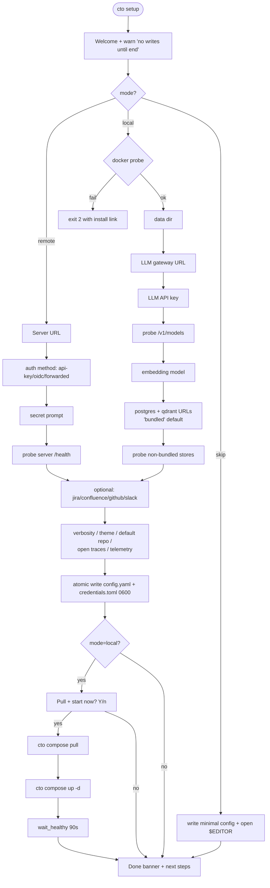
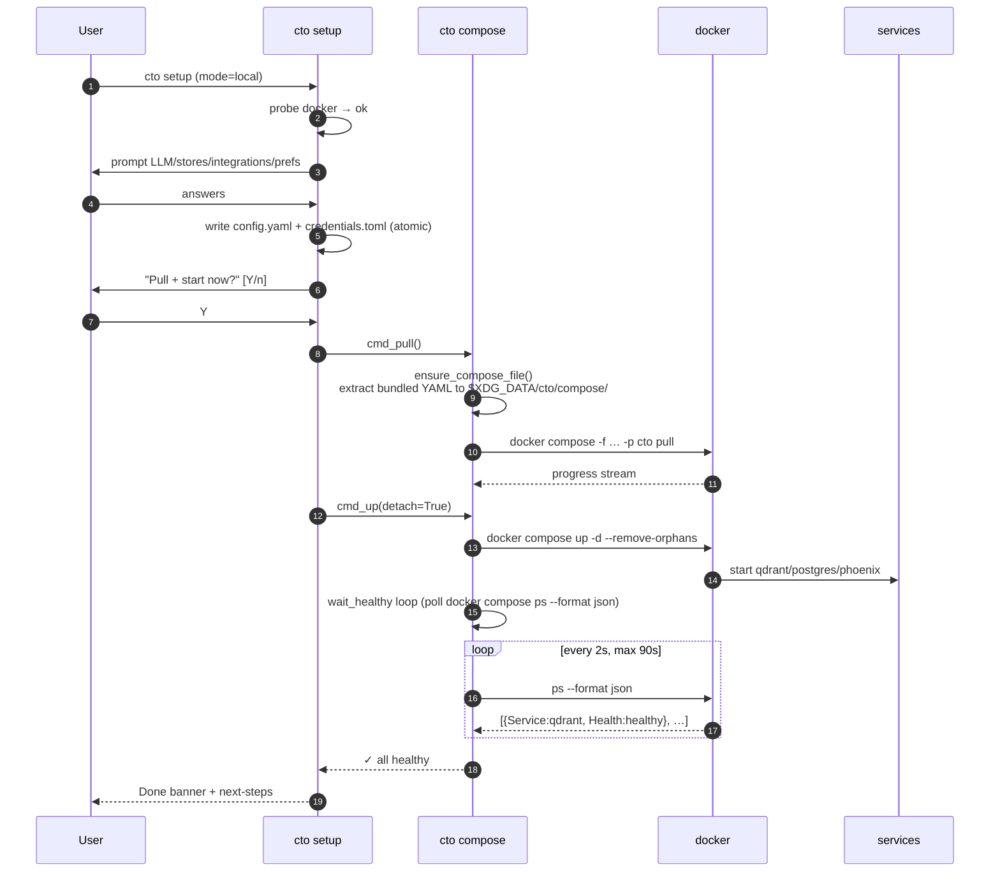

# Phase 10 — Distribution: binary CLI + setup wizard

> Phases 0-9 built a working agentic-RAG system the developer
> runs with `pip install -e .` + `make chat`. Phase 10 turns
> `cto` into an **end-user product**: one downloaded binary,
> wizard-driven config, optional Docker bootstrap of the
> backing infra. No Python install on the target. No CI release
> pipeline. Distribution = drop the artifact into an internal
> share.
>
> **Scope cuts (per user direction):**
> - macOS arm64 + x86_64 only; Linux/Windows later
> - Offline distribution (no GitHub Releases, no Homebrew, no
>   auto-update channel)
> - Docker required for local-mode (no native-binary stores)
> - Single full wizard re-run (no per-section sub-wizards)
> - Single shared `cto` compose project (no per-user namespace)
>
> Sprint 1 (skills hardening — top-10 issue #1) is its own track;
> plan in `docs/SPRINT1_SKILLS_HARDENING.md`.

---

## 1. System

```mermaid
flowchart LR
    subgraph user[user's machine]
      BIN["cto binary<br/>(PyInstaller --onefile)<br/>~30-50 MB"]
      XDG[("XDG dirs:<br/>~/.config/cto/<br/>~/.local/share/cto/<br/>~/.local/state/cto/")]
      DOCKER["docker daemon<br/>(Docker Desktop / Engine)"]
      INFRA[("cto-qdrant · cto-postgres<br/>cto-phoenix<br/>(local mode only)")]
    end

    subgraph remote[remote (optional)]
      SERVER["CTO server<br/>(your-org deployment)"]
    end

    BIN -->|reads/writes config| XDG
    BIN -->|"setup wizard,<br/>compose subcmd"| DOCKER
    DOCKER -->|brings up| INFRA
    BIN -->|cto chat (remote mode)<br/>HTTP/SSE + Bearer key| SERVER
    BIN -.cto chat (local mode + Python install).- INFRA

    classDef new fill:#3a3,color:#fff,stroke:#0a0
    class BIN,XDG,INFRA new
```

**One binary, two run modes:**

| Mode | What the binary does | Where the app actually runs |
|---|---|---|
| **remote** | Wizard collects server URL + Bearer key. `cto chat` = thin SSE client. | On your-org's CTO server (or laptop's `pip install -e .` setup). |
| **local** | Wizard bootstraps qdrant/postgres/phoenix via Docker. `cto chat` requires a separate `pip install -e .` of the app code (until the cto-app image is packaged in a later phase). | Locally, in-process Python graph against the binary-spawned data stores. |

The binary is **always thin**. Including the ML stack (torch +
sentence-transformers + langgraph + ...) would push it past 700
MB. Slice-2 ships compose for infra only; slice-N (later) can
add `cto-app:latest` to the bundled compose once a registry is
agreed.

---

## 2. CLI subcommand surface

```
cto setup              # interactive wizard (full re-run each time)
cto doctor [--unsafe]  # connectivity + perms diagnostic (redacted)
cto compose pull       # docker compose pull (3 services)
cto compose up         # up -d + wait healthy (90s timeout)
cto compose down [-v]  # stop; -v wipes data volumes
cto compose ps
cto compose logs [svc] [-f] [--tail=N]
cto compose status     # one-shot health probe
cto chat [...]         # original REPL — unchanged
cto [question]         # one-shot question — unchanged
```

`cto chat`, `cto [question]`, `cto --help` keep their existing
behavior. Subcommands are dispatched in `api/cli.py:main()`
BEFORE argparse so they don't trigger the heavy graph/tracing
imports the REPL needs.

---

## 3. Layout

```
src/rag/cli/                              ← NEW package
├── __init__.py
├── _config.py     XDG read/write; atomic; 0600 for credentials
├── _health.py     stdlib-only probes; redact() helper
├── setup.py       wizard runner; remote/local/skip branches
├── doctor.py      diagnostic report; redacted by default
└── compose.py     docker compose driver; bundled-file extraction

packaging/
├── README.md                 build flow + distribution model
├── pyinstaller_cto.spec      thin-client spec (excludes ML stack)
└── compose.cto-infra.yaml    bundled in binary via datas=[]

Makefile additions:
  binary, binary-mac-arm64, binary-mac-x86_64, binary-clean

pyproject.toml additions:
  [project.optional-dependencies]
  binary = ["pyinstaller>=6.0"]
```

---

## 4. Wizard flow



**Defaults pre-filled from existing config** so a full re-run is
mostly hitting Enter. Secret prompts show `<existing>` sentinel
— hitting Enter or typing `<existing>` keeps the previous value
without echoing it.

**No partial writes:** Ctrl-C anywhere before the persist step =
no on-disk change. Both files written atomically via `.tmp` +
`os.replace`. Credentials file forced to 0600 regardless of
umask; parent dir to 0700.

---

## 5. XDG layout

| Path | Contents | Perms |
|---|---|---|
| `$XDG_CONFIG_HOME/cto/config.yaml` | non-secret settings, server URL, prefs | 644 |
| `$XDG_CONFIG_HOME/cto/credentials.toml` | API keys, tokens (no passwords stored) | **600** |
| `$XDG_DATA_HOME/cto/compose/docker-compose.yaml` | extracted from binary on first use | 644 |
| `$XDG_DATA_HOME/cto/qdrant/`, `postgres/`, `phoenix/` | bind-mount targets for compose stack | 755 |
| `$XDG_STATE_HOME/cto/` | session history, command history | 755 |
| `$XDG_CACHE_HOME/cto/` | reserved (hf-cache later) | 755 |

`.env` files are **only** for developer installs. End-user
binary never reads `.env`; everything is XDG.

---

## 6. Compose bootstrap (slice 2)



**Compose file source of truth:** `packaging/compose.cto-infra
.yaml` (3 services with healthchecks). PyInstaller bundles it
via `datas=[("compose.cto-infra.yaml", ".")]`. At runtime the
binary locates it via:

1. `sys._MEIPASS` (PyInstaller-extracted temp dir)
2. `<repo>/packaging/` (dev runs without binary)

If neither found → hard error with actionable message.

**`CTO_DATA_DIR` env injection:** compose file uses
`${CTO_DATA_DIR:-./cto-data}` for bind-mounts. The driver
exports `CTO_DATA_DIR=$XDG_DATA_HOME/cto` before invoking
docker so volumes land in the user's data dir, not pwd.

---

## 7. Doctor output

```
$ cto doctor
─── CTO doctor ──────────────────────────────────────
  mode: local
  config: ~/.config/cto/config.yaml

     Check               Status
     config.yaml         ok
     credentials.toml    ok
     data dir            ok
     state dir           ok
   ✓ docker daemon       ok (docker 28.0.4)
   ✓ LLM gateway         ok (14 models available)
   ✓ postgres            ok (tcp localhost:5432)
   ✓ qdrant              200 OK
   ✓ jira                ok (Vishwa Janmanchi)

All checks passed.
```

**Default = redacted.** URLs collapse to `https://<redacted>`,
hostnames stripped, long tokens masked to `abc…xy`, $HOME paths
to `~`. `--unsafe` shows full — user has to type the word, so
no accidental over-share when pasting in a Slack channel.

Exit codes: `0` all pass, `1` ≥1 failed, `2` no config (run
`cto setup`).

---

## 8. Binary packaging

```
make binary             → dist/cto-darwin-arm64  (~30-50 MB)
make binary-mac-x86_64  → dist/cto-darwin-x86_64 (must run on Intel)
make binary-clean
```

PyInstaller `--clean --noconfirm` against the spec. Excludes
push the binary down by ~650 MB vs a naive build:

| Excluded | Why |
|---|---|
| torch, transformers, sentence_transformers, fastembed | local ML stack — server-side concern |
| langchain*, langgraph*, openai, anthropic | agent ecosystem — server-side |
| qdrant_client, psycopg, tree_sitter* | data stores + parsing — server-side |
| fastapi, uvicorn, gradio, starlette | server frameworks |
| pymupdf, tavily, phoenix-otel, watchdog | ingestion + observability — server-side |
| numpy, pandas, scipy, PIL, tkinter | unused stdlib/transitive |

`upx=False` — macOS Gatekeeper quarantines UPX-compressed
binaries.

`target_arch=None` — native build only. PyInstaller does not
cross-compile; arm Mac builds arm, Intel Mac builds Intel.

Distribution = drop `dist/cto-darwin-{arch}` into your team's
artifact share. Generate `shasum -a 256 > .sha256` manually.

Gatekeeper note: unsigned binary needs `xattr -d com.apple
.quarantine ./cto-darwin-arm64` on first run. Codesigning in a
later phase.

---

## 9. What's NOT in Phase 10

| Feature | Why deferred |
|---|---|
| `cto-app` image in bundled compose | Needs a public/private registry; no agreement yet |
| Per-user compose namespacing | User scoped this out for v1 |
| Linux + Windows binaries | macOS-first; cross-compile later |
| `cto upgrade` self-update | Offline distribution = no update channel |
| Universal2 fat binaries | Per-arch shipped instead; simpler |
| Codesigning + notarization | Phase 10.1 |
| `cto skill install <url>` marketplace | Depends on Sprint 1 skill hardening first |
| HSM-backed credentials.toml | Plain file-perm 600 for v1 |

---

## 10. Phase 9 vs 10 comparison

| Aspect | Phase 9 (scheduler) | Phase 10 (distribution) |
|---|---|---|
| Installation | `pip install -e .` from cloned repo | drop binary into PATH |
| Configuration | Manual `.env` editing | `cto setup` wizard |
| Verification | grep through logs | `cto doctor` |
| Infra lifecycle | `make infra` Make targets | `cto compose up/down` |
| Per-user config | $HOME-relative file paths | XDG-compliant + 600 secrets |
| Audience | developers contributing to CTO | end users of CTO |
| Distribution channel | git pull | offline artifact share |

---

## 11. Verification checklist (run after install)

1. `cto --help` → shows subcommands list
2. `cto setup` → wizard runs; defaults pre-filled on re-run
3. `cto doctor` (after wizard) → all probes green
4. `cto compose status` → shows live service health
5. `cto compose down -v` then `cto setup` → can re-bootstrap from scratch
6. With Ctrl-C mid-wizard → config file unchanged
7. `stat -f %A ~/.config/cto/credentials.toml` → `600`
8. `cto chat` → connects to configured backend
