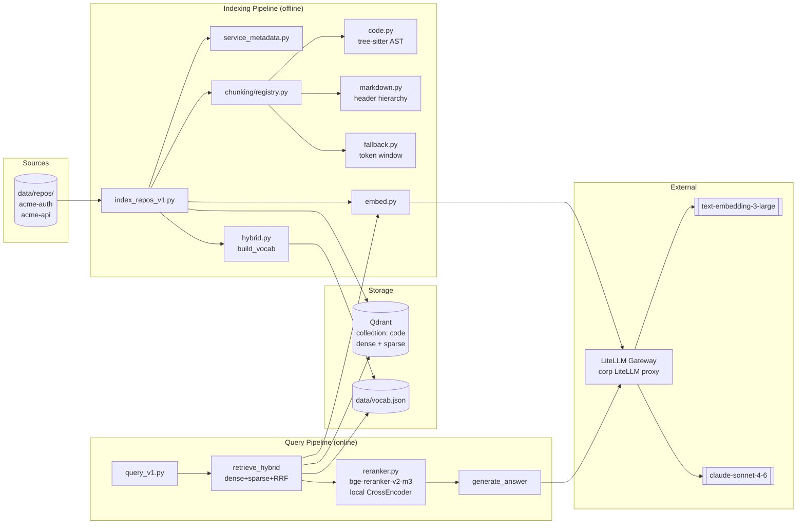
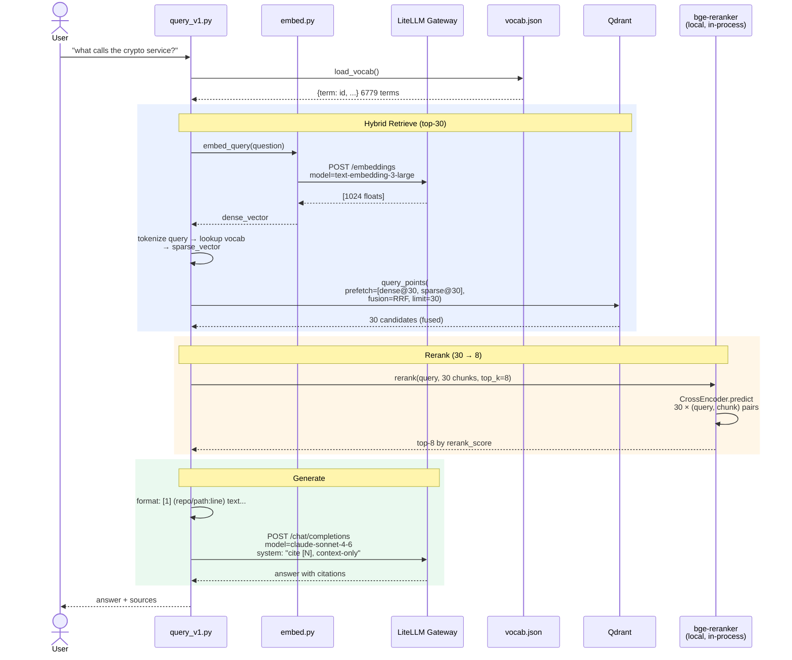
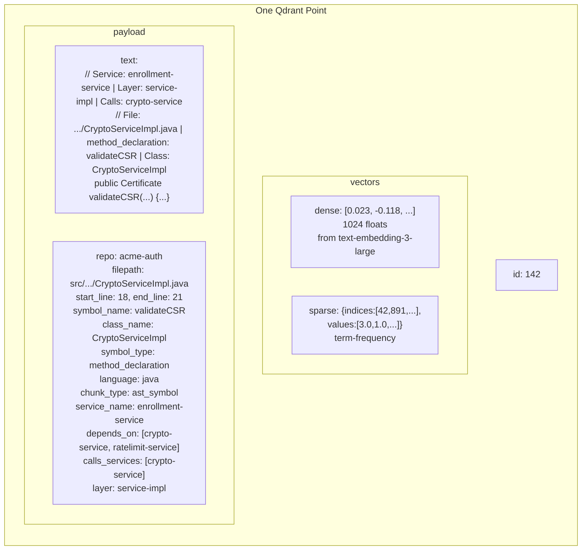
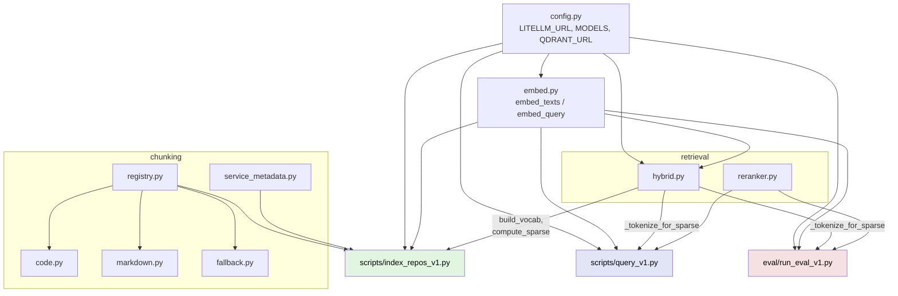

# Phase 1 — Architecture & Code Flow

> Renders in GitLab, GitHub, VS Code (Markdown Preview Mermaid Support extension).

## 1. System Architecture



## 2. Indexing Flow (per repo)

```mermaid
flowchart TD
    start([data/repos/&lt;repo&gt;]) --> meta[extract_repo_metadata<br/>scan application.properties + *.java]
    meta --> metaOut{{service_name<br/>depends_on<br/>exposed_endpoints}}

    metaOut --> walk[walk all files<br/>filter by CODE_EXTENSIONS<br/>skip vendor/.git/build]

    walk --> route{registry.chunk_file<br/>by extension}
    route -->|.java .py .go .js .ts| ast[code.py<br/>tree-sitter parse → AST<br/>collect method/class nodes<br/>1 symbol = 1 chunk<br/>split if &gt;1500 tokens]
    route -->|.md| mdc[markdown.py<br/>split on headings<br/>maintain breadcrumb stack]
    route -->|other| fbc[fallback.py<br/>500-token windows]

    ast --> enrich
    mdc --> enrich
    fbc --> enrich

    enrich[enrich each chunk:<br/>+ service_name, depends_on, layer, calls_services → payload<br/>+ '// Service: X | Layer: Y | Calls: Z' → text prefix]

    enrich --> collect[(all_chunks)]

    collect --> bv[build_vocab_from_chunks<br/>tokenize all → term→id map]
    bv --> savev[(vocab.json)]

    collect --> create[Qdrant: delete + create collection<br/>dense: 1024-dim cosine<br/>sparse: inverted index]

    create --> batch[batch of 64 chunks]
    batch --> dense[embed_texts → LiteLLM<br/>→ 1024 floats each]
    batch --> sparse[compute_sparse_vector<br/>term freq → indices+values]
    dense --> upsert
    sparse --> upsert
    upsert[qdrant.upsert<br/>PointStruct: id, dense, sparse, payload]
    upsert --> done([798 points indexed])
```

## 3. Query Flow



## 4. Chunk Anatomy



## 5. Module Dependency Graph



## 6. Phase 0 vs Phase 1 — What Changed

| Stage | Phase 0 | Phase 1 |
|---|---|---|
| Chunking | 500-token sliding window | tree-sitter AST (code) / header-hierarchy (md) / fallback |
| Enrichment | none | `// Service | Layer | Calls | File | Symbol | Class` prefix |
| Metadata | repo, filepath, start_line | + symbol_name, class_name, language, service_name, depends_on, calls_services, layer |
| Vectors | dense only | dense + sparse (term-frequency) |
| Search | cosine top-5 | dense + sparse → RRF fusion → top-30 |
| Post-process | none | bge-reranker-v2-m3 cross-encoder → top-8 |
| Recall@1 | 0.60 | **1.00** |
| Recall@5 | 0.80 | **1.00** |
