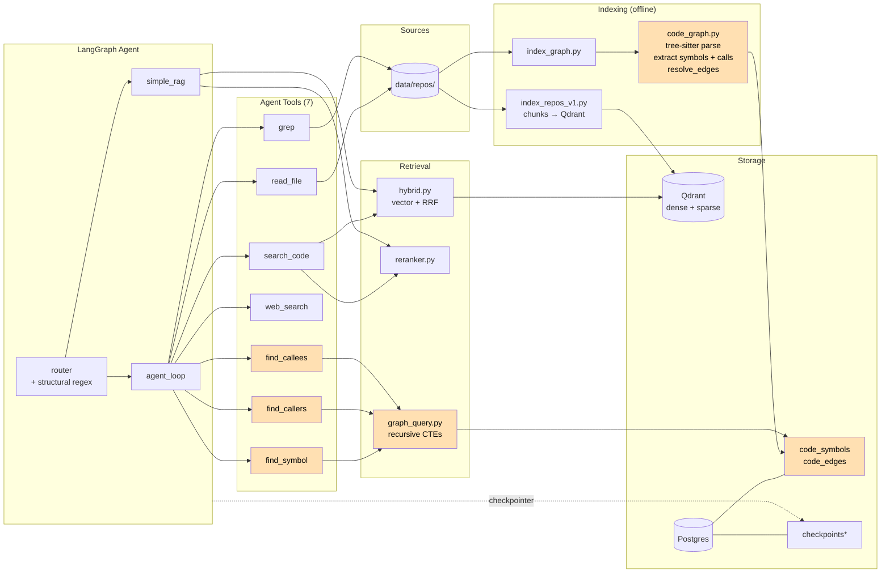
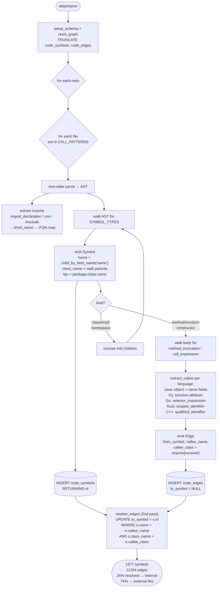
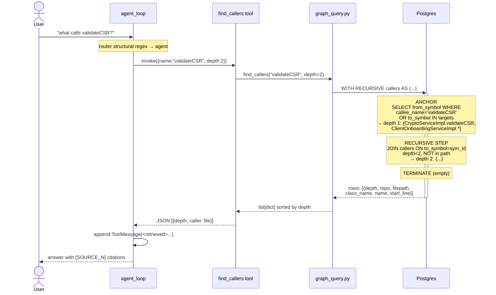
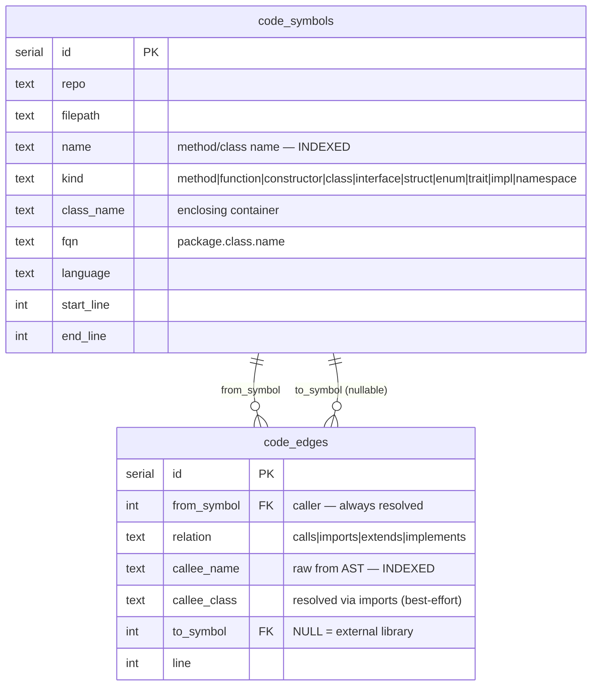
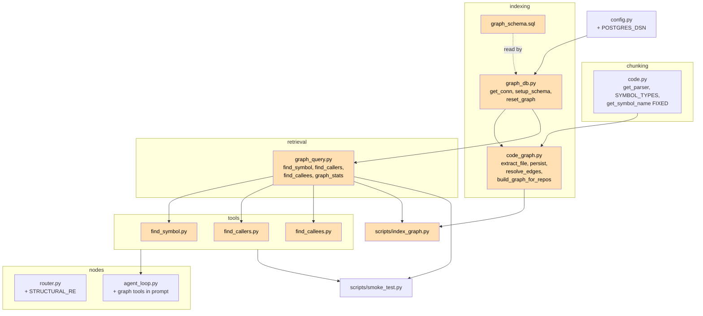

# Phase 2.5 — Architecture & Code Flow

> Code graph: tree-sitter call extraction → Postgres (`code_symbols`, `code_edges`) → recursive-CTE queries → `find_symbol` / `find_callers` / `find_callees` agent tools. Adds **structural** retrieval alongside Phase 1's semantic+keyword retrieval.

## 1. System Architecture

## 2. Graph Indexing Flow

## 3. Graph Query Sequence (find_callers via recursive CTE)

## 4. Data Anatomy — Postgres Code Graph

**Why `to_symbol` is nullable:** `enrollment` calls `CryptoUtil.setCryptoServiceURL` from the external `com.example.crypto.api` JAR. The edge is recorded with `callee_name="setCryptoServiceURL"`, `callee_class="com.example.crypto.api.CryptoUtil"`, `to_symbol=NULL`. `find_callees` reports it as `kind=external` — so the agent knows it's a library call, not missing data.

**Resolution strategy:** name-only with import hints. ~26% of edges resolve to indexed symbols; the rest are JDK/Spring/external. Accuracy ~80-90% for resolved edges; false positives occur on common method names (`generate`, `get`) across repos.

## 5. Module Dependency Graph

## 6. Phase 2 vs Phase 2.5 — What Changed

| Aspect | Phase 2 | Phase 2.5 |
|---|---|---|
| Retrieval modalities | 2 (semantic + keyword) | **3** (semantic + keyword + **structural**) |
| Postgres usage | checkpointer only | + `code_symbols`, `code_edges` (graph) |
| Agent tools | 4 (search_code, read_file, grep, web_search) | **7** (+ find_symbol, find_callers, find_callees) |
| "what calls X?" answer path | search_code + grep + read_file (3-6 iter) | `find_callers(X)` (1 tool call) |
| Router | history + LLM classifier | + `_STRUCTURAL_RE` regex short-circuit for graph queries |
| Languages w/ AST chunking | 5 (Java/Py/Go/JS/TS) | **7** (+ Rust, C/C++) |
| `_get_symbol_name` | first identifier-like child (returned Java return types — bug) | `child_by_field_name('name')` → correct method names |
| Indexing entry | `make index-v1` | `make index-v1` + `make index-graph` (or `make index-all`) |
| New deps | — | none (psycopg already present; reuses tree-sitter parsers) |
| Lines added | — | ~780 across 11 new files |

### Bugs found & fixed during Phase 2.5

| Bug | Fix |
|---|---|
| `psycopg` couldn't infer type of NULL `%(repo)s` param | Cast `%(repo)s::text` in CTE |
| Java method names extracted as return type (`Certificate` not `validateCSR`) | Use `child_by_field_name('name')` instead of first child match — also fixes Phase 1 chunk metadata |
| `resolve_edges()` reported total rows touched, not actually resolved | Count `WHERE to_symbol IS NOT NULL` after update |
| Router sent "what calls X?" to `simple_rag` (no tools) | Structural regex routes to `agent_loop` |

### Measured impact (acme-auth + acme-api)

| Metric | Value |
|---|---|
| Symbols indexed | 1,877 |
| Call edges | 11,264 |
| Resolution rate | 26.3% (rest = JDK/Spring/external libs) |
| `find_symbol('validateCSR')` | 3 defs (interface + impl + util) — instant |
| `find_callers('validateCSR', depth=3)` | 12 callers (3 prod, 9 test) — instant |
| Same question via Phase 2 agent | 6 iterations, ~15s |
