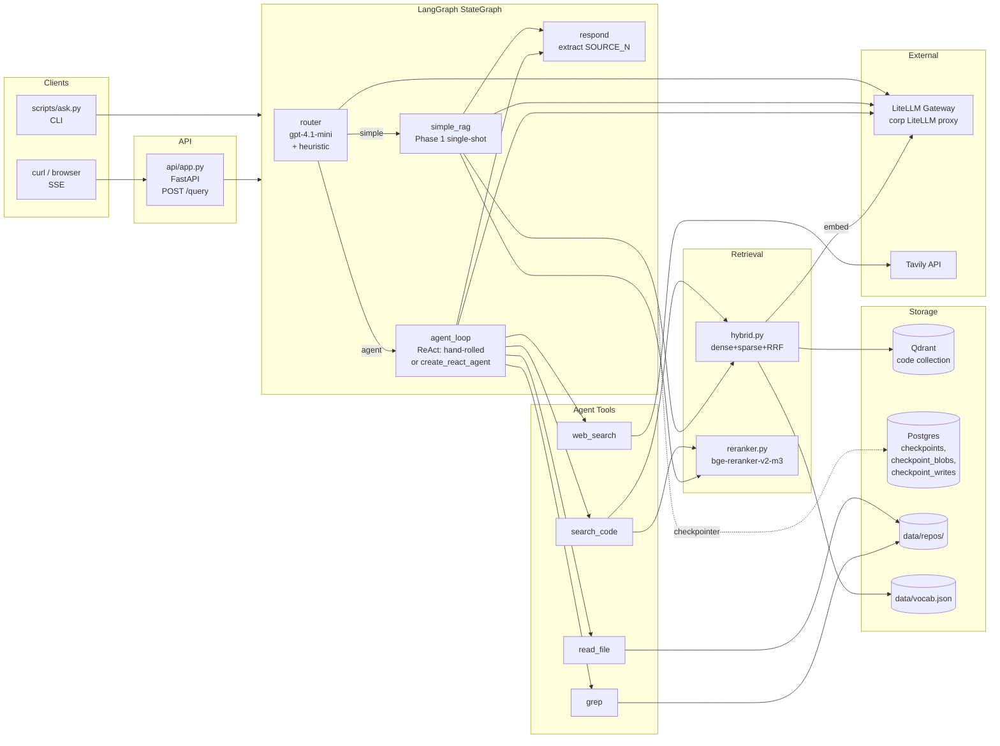
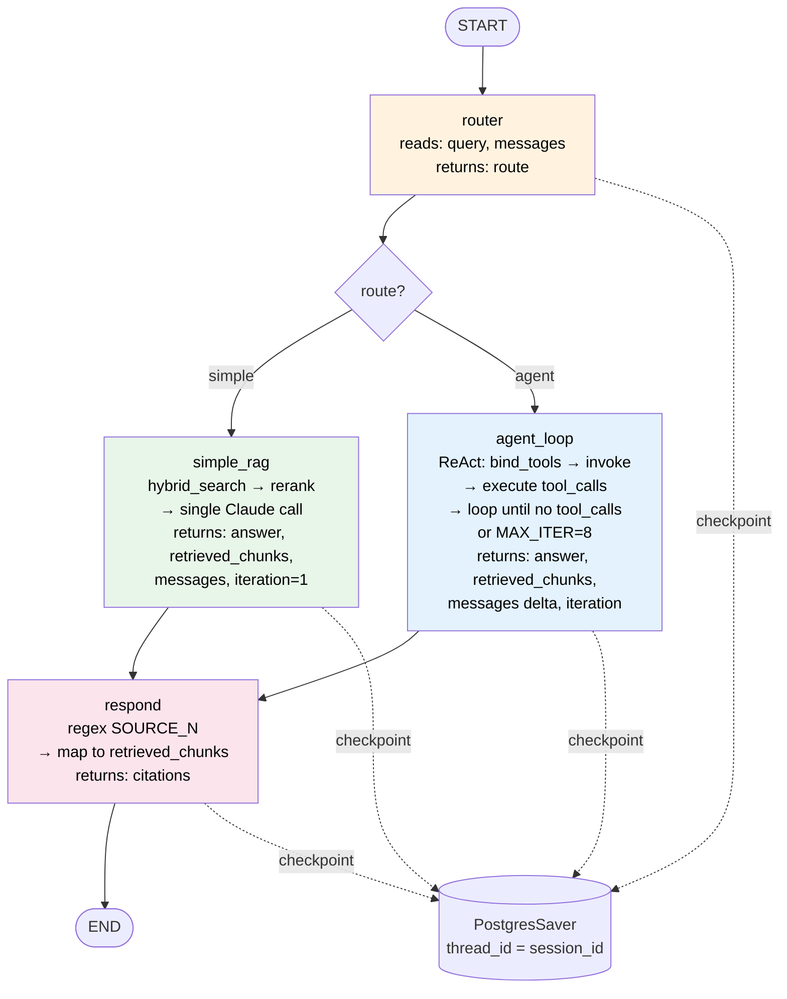
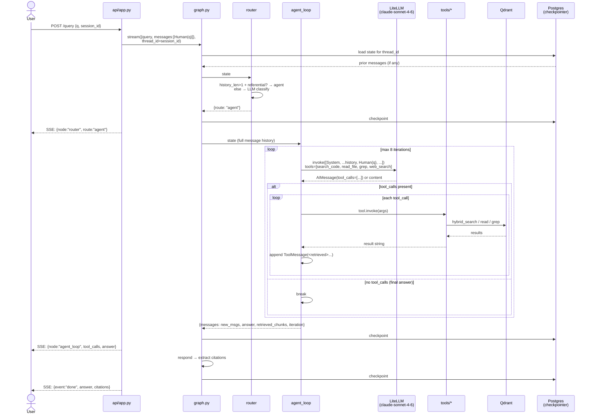
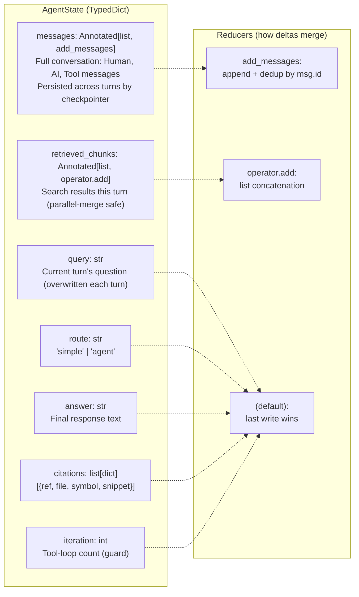
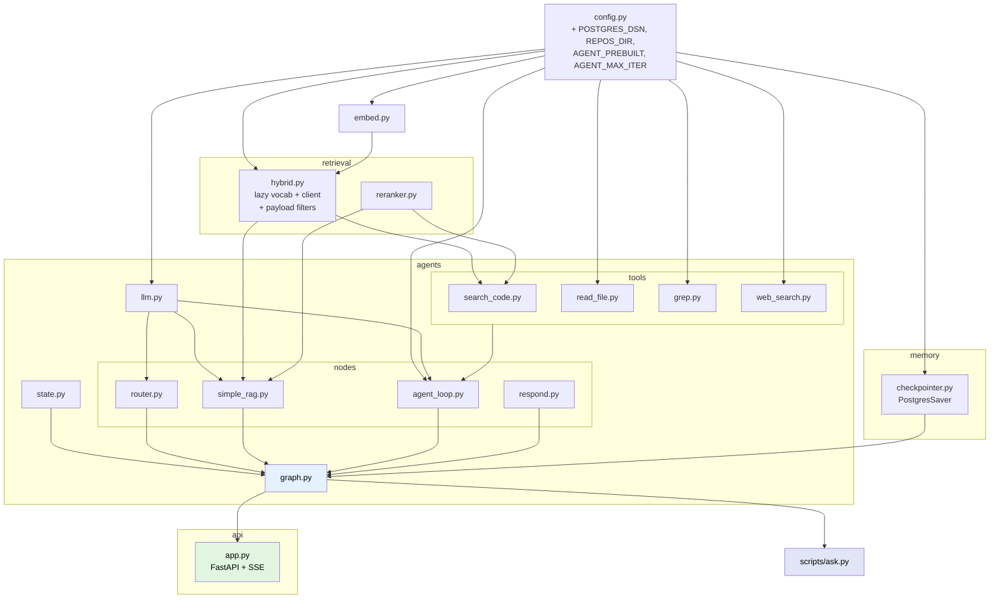

# Phase 2 — Architecture & Code Flow

> LangGraph StateGraph: router → {simple_rag | agent_loop} → respond. PostgresSaver checkpointer for multi-turn. FastAPI + SSE streaming. Tools: search_code, read_file, grep, web_search.

## 1. System Architecture



## 2. StateGraph Flow



## 3. Agent Loop Sequence (ReAct, hand-rolled)



## 4. Data Anatomy — AgentState



**Checkpointer storage (Postgres):**

```
checkpoints           — one row per (thread_id, checkpoint_id); state snapshot pointer
checkpoint_blobs      — serialized state values (msgpack)
checkpoint_writes     — pending writes between nodes
checkpoint_migrations — schema version
```

## 5. Module Dependency Graph



## 6. Phase 1 vs Phase 2 — What Changed

| Aspect | Phase 1 | Phase 2 |
|---|---|---|
| Execution model | Script: `query_v1.py` runs once, exits | Service: LangGraph StateGraph, stateful, always-on |
| Entry point | `make query-v1 Q="..."` | `make ask Q="..." S=sid` (CLI) or `make serve` + `POST /query` (HTTP/SSE) |
| Routing | None — always full retrieve→rerank→generate | `router` node: heuristic + gpt-4.1-mini → `simple` or `agent` |
| Retrieval strategy | Fixed: hybrid → rerank → top-8 → stuff prompt | Agent decides: search_code (multiple times), read_file, grep, web_search |
| Iteration | 1 LLM call | 1 (simple) or up to 8 (agent loop) |
| Multi-turn memory | None | PostgresSaver checkpointer keyed by `thread_id` |
| Citations | `[N]` ad-hoc | `[SOURCE_N]` extracted to structured `citations[]` |
| Streaming | Print at end | SSE events per node (router → tool calls → answer → done) |
| Tool implementations | n/a | 4 tools: search_code (wraps Phase 1), read_file, grep (rg), web_search (Tavily) |
| `hybrid.py` | Vocab passed by caller, eager Qdrant connect | Self-contained: lazy vocab + client, repo/layer payload filters |
| New deps | — | langgraph, langchain-openai, langchain-core, langgraph-checkpoint-postgres, psycopg, fastapi, uvicorn, sse-starlette, tavily-python |
| Lines added | — | ~700 across 16 new files |

### Known issues found during checkpoint

| Issue | Fix applied |
|---|---|
| Router ignored conversation history → follow-ups routed `simple` → wrong retrieval | Router now reads `state["messages"]`; heuristic short-circuit (referential language + history → `agent`); LLM classifier sees prior turns |
| `agent_loop` returned full history instead of delta → `add_messages` would duplicate | Returns only `messages[prior_count:]` |
| Hardcoded "acme codebase" / enrollment-specific examples | Genericized in system prompts |
