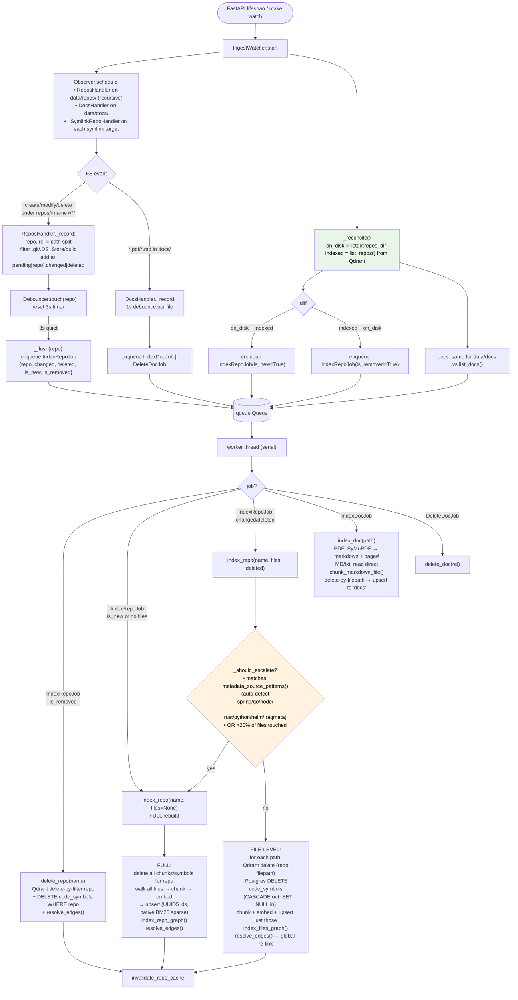

# Phase 3.5 — Architecture & Code Flow

> Autonomous local ingestion + Web UI. Five tracks: (A) Qdrant native BM25 replaces `vocab.json`, (B) PDF/MD docs pipeline + `search_docs` tool, (C) incremental indexer (repo-level + file-level), (D) filesystem watcher with debounce + reconcile, (E) Gradio chat UI mounted in FastAPI. Plus: `repo_info` tool, fuzzy repo-name resolution, token-streaming UI, reranker pre-warm.

## 1. System Architecture

```mermaid
flowchart LR
    subgraph FS["Filesystem (watched)"]
        repos[(data/repos/<br/>symlinks → real repos)]
        docsd[(data/docs/<br/>*.pdf *.md *.txt)]
    end

    subgraph Watcher["IngestWatcher (in FastAPI lifespan)"]
        obs[watchdog Observer<br/>FSEvents/inotify]
        rh[ReposHandler<br/>per-repo 3s debounce<br/>collect changed/deleted]
        slh[_SymlinkRepoHandler<br/>watches link targets]
        dh[DocsHandler<br/>per-file 1s debounce]
        rec[_reconcile<br/>disk vs index diff<br/>at startup]
        q[(queue.Queue)]
        wk[worker thread<br/>serial consumer]
        obs --> rh
        obs --> slh
        obs --> dh
        rh --> q
        slh --> rh
        dh --> q
        rec --> q
        q --> wk
    end

    subgraph Ingest["ingest/"]
        inc[incremental.py<br/>index_repo / delete_repo<br/>full | file-level + escalation]
        idoc[docs.py<br/>index_doc / delete_doc]
        pdf[pdf.py<br/>PyMuPDF → markdown<br/>font-size → headings]
    end

    subgraph Storage
        qcode[(Qdrant 'code'<br/>dense + IDF sparse<br/>UUID5 ids)]
        qdocs[(Qdrant 'docs'<br/>dense + IDF sparse<br/>UUID5 ids)]
        pg[(Postgres<br/>code_symbols/edges<br/>+ checkpoints)]
    end

    subgraph API["FastAPI :8000"]
        app[app.py<br/>lifespan: warm reranker<br/>+ start watcher]
        ui[ui.py — Gradio /ui<br/>token-stream chat<br/>collapsible sidebar<br/>&lt;details&gt; trace]
        ep["/query SSE<br/>/sources /sessions<br/>/health"]
    end

    subgraph Graph["LangGraph Agent"]
        router[router<br/>+ service-level regex]
        aloop[agent_loop<br/>dynamic system prompt:<br/>lists indexed repos]
    end

    subgraph Tools["Agent Tools (10)"]
        sc[search_code]
        sd[search_docs]:::new
        ri[repo_info]:::new
        rf[read_file]
        gp[grep]
        fs[find_symbol]
        fcr[find_callers]
        fce[find_callees]
        ec[execute_code]
        ws[web_search]
        rr["_repo.py<br/>resolve_repo()<br/>fuzzy match"]:::new
    end

    repos -.events.-> obs
    docsd -.events.-> obs
    wk --> inc
    wk --> idoc
    idoc --> pdf
    inc --> qcode
    inc --> pg
    idoc --> qdocs

    app --> Watcher
    app --> ui
    app --> ep
    ui --> Graph
    ep --> Graph
    Graph --> Tools

    sc --> rr
    rf --> rr
    gp --> rr
    fs --> rr
    fcr --> rr
    fce --> rr
    ec --> rr
    ri --> rr

    sc --> qcode
    sd --> qdocs
    fs --> pg
    fcr --> pg
    fce --> pg

    classDef new fill:#ffe0b2,color:#000,stroke:#e65100
```

## 2. Watcher → Incremental Indexing Flow



## 3. UI Streaming Sequence

```mermaid
sequenceDiagram
    actor User
    participant UI as Gradio /ui<br/>(_chat generator)
    participant G as LangGraph
    participant L as LiteLLM<br/>(streaming=True)
    participant T as tools

    User->>UI: type query, Enter
    UI->>UI: append {user}, {assistant:"…thinking"}<br/>yield history
    UI->>G: stream(inputs, thread_id,<br/>stream_mode=["messages","updates"])

    rect rgba(80, 140, 255, 0.12)
    note over G,L: messages mode — per-token from INSIDE nodes
    G->>L: agent_loop invokes llm.bind_tools()
    loop per token
        L-->>G: AIMessageChunk(content / tool_call_chunks)
        G-->>UI: ("messages", (chunk, {langgraph_node}))
        UI->>UI: tool_call name? → trace "▸ name(…)"<br/>content? → streaming_text += chunk
        UI-->>User: yield history (re-render <details> open)
    end
    end

    G->>T: execute tool_calls
    T-->>G: results

    rect rgba(255, 180, 60, 0.12)
    note over G,UI: updates mode — after each NODE completes
    G-->>UI: ("updates", {router: {route}})
    UI->>UI: trace.insert(0, "▸ router → agent")
    G-->>UI: ("updates", {agent_loop: {messages, answer, iteration}})
    UI->>UI: replace "▸ name(…)" with full args<br/>append "↳ result preview"<br/>set answer; trace += "▸ iterations: N"
    G-->>UI: ("updates", {respond: {citations}})
    UI->>UI: citations
    end

    UI->>UI: render(done=True)<br/>"🔍 Reasoned for Xs · N steps" (collapsed)
    UI-->>User: final yield

    note over User,UI: ⏹ Stop button → gradio cancels=[ev_submit, ev_send]<br/>generator interrupted mid-stream
```

## 4. Data Anatomy

```mermaid
flowchart TB
    subgraph qcode["Qdrant 'code' point (changed in 3.5-A)"]
        direction TB
        qid["id: UUID5(ns, 'repo|filepath|chunk_idx')<br/>STABLE — re-index = upsert in place"]
        qdv["dense: [1024 floats]"]
        qsv["sparse: models.Document(text, model='Qdrant/bm25')<br/>→ Qdrant tokenizes server-side<br/>→ Modifier.IDF on collection<br/>NO vocab.json"]
        qpl["payload: text, repo, filepath, chunk_idx,<br/>symbol_name, class_name, chunk_type,<br/>service_name, depends_on, layer, calls_services"]
    end

    subgraph qdoc["Qdrant 'docs' point (new in 3.5-B)"]
        direction TB
        did["id: UUID5(ns, 'docs|relpath|chunk_idx')"]
        ddv["dense + sparse (same config)"]
        dpl["payload: text, filepath, source∈{pdf,markdown,text},<br/>section_path, page_number (PDFs), chunk_idx"]
    end

    subgraph ir["IndexResult (3.5-C)"]
        direction TB
        irf["repo, mode∈{full,file,delete}<br/>files_processed, chunks, symbols, edges<br/>escalated, escalation_reason, deleted_files"]
    end

    subgraph jobs["Watcher Jobs (3.5-D)"]
        direction TB
        j1["IndexRepoJob: repo, changed:set, deleted:set,<br/>is_new_repo, is_removed_repo"]
        j2["IndexDocJob: path"]
        j3["DeleteDocJob: rel_path"]
    end

    subgraph rrm["resolve_repo() (fuzzy)"]
        direction TB
        r1["exact match → (repo, None)"]
        r2["single substring match → (match, None)<br/>'mgmtapi' → 'acme-api'"]
        r3["multiple matches → (None, 'ambiguous: X, Y. Available: …')"]
        r4["no match → (None, 'not found. Available: …')"]
    end
```



## 5. Module Dependency Graph

```mermaid
flowchart TD
    cfg[config.py]

    subgraph retrieval
        hyb[hybrid.py<br/>sparse_doc(); collection arg;<br/>exists guard]:::changed
        rr[reranker.py<br/>local_files_only]
    end

    subgraph ingest[":new ingest/"]
        inc[incremental.py<br/>index_repo/delete_repo<br/>list_repos, escalation]:::new
        idoc[docs.py<br/>index_doc/delete_doc<br/>list_docs]:::new
        ipdf[pdf.py<br/>pdf_to_markdown]:::new
        wat[watcher.py<br/>IngestWatcher, _Debouncer<br/>Repos/Docs/Symlink handlers<br/>_reconcile]:::new
    end

    subgraph chunking
        sm[service_metadata.py<br/>+ metadata_source_patterns()]:::changed
        chk[code/markdown/fallback<br/>lazy _tokenizer()]:::changed
    end

    subgraph tools["agents/tools/"]
        rrep[_repo.py<br/>resolve_repo, available_repos<br/>invalidate_repo_cache]:::new
        sd[search_docs.py]:::new
        ri[repo_info.py]:::new
        all["search_code/read_file/grep/<br/>find_*/execute_code<br/>+ resolve_repo() guard"]:::changed
    end

    subgraph nodes
        rt[router.py<br/>+ service-level regex]:::changed
        al[agent_loop.py<br/>_system_prompt() injects<br/>available_repos()]:::changed
    end

    subgraph api
        app[app.py<br/>lifespan: warm reranker<br/>+ IngestWatcher<br/>/sources /sessions<br/>mount /ui]:::changed
        uif[ui.py<br/>Gradio Blocks fill_height<br/>Sidebar, &lt;details&gt; trace<br/>token-stream, stop btn,<br/>dark mode, gr.HTML(style)]:::new
    end

    cfg --> hyb
    cfg --> inc
    sm --> inc
    chk --> inc
    hyb --> inc
    chk --> idoc
    hyb --> idoc
    ipdf --> idoc
    inc --> wat
    idoc --> wat
    rrep --> wat

    inc --> rrep
    rrep --> all
    rrep --> ri
    rrep --> al
    sm --> ri
    hyb --> sd
    rr --> sd

    wat --> app
    inc --> app
    idoc --> app
    uif --> app

    smoke[smoke_test.py<br/>+10 incremental, +7 docs,<br/>+6 watcher, +3 resolve_repo,<br/>+2 repo_info]:::changed
    pwt[test_ui_playwright.py]:::new

    classDef new fill:#ffe0b2,color:#000,stroke:#e65100
    classDef changed fill:#e3f2fd,color:#000,stroke:#1565c0
```

## 6. Phase 3 vs Phase 3.5 — What Changed

| Aspect | Phase 3 | Phase 3.5 |
|---|---|---|
| Sparse vectors | Hand-rolled term-freq vocab (`data/vocab.json`, frozen at index time) | **Qdrant native BM25**: `models.Document` + `Modifier.IDF`. Server-side tokenization, incremental-safe, proper TF-IDF. −159 LoC |
| Qdrant point IDs | Sequential `0..N` | **Stable UUID5**(`repo|filepath|chunk_idx`) — re-index = upsert in place |
| Indexing | `make index-v1` only — full wipe + rebuild | **Incremental**: `index_repo(name, files=None|[...])` repo- and file-level; auto-escalate on metadata-source change or >20% touched. `make index-add REPO=X [FILES=...]` |
| Doc sources | None (code only) | **`docs` collection**: PDF (PyMuPDF font→heading + page#) / MD / txt via `chunk_markdown_file()`. `make index-doc` / `index-docs` |
| Auto-ingestion | Manual `make` only | **`IngestWatcher`**: watchdog + per-key debounce + worker queue. Symlink-target watching. **Startup `_reconcile()`** diffs disk vs index. Runs in FastAPI lifespan + `make watch` |
| Agent tools | 8 | **10**: + `search_docs`, + `repo_info` (service-level depends_on/endpoints/URLs) |
| Repo arg handling | Verbatim — `'mgmtapi'` → "no results" | **`resolve_repo()`**: exact → single fuzzy auto-correct → ambiguous/unknown w/ available list. Applied to all 7 repo-taking tools |
| Agent system prompt | Static, hardcoded `acme-auth` example | **Dynamic** `_system_prompt()`: injects live `available_repos()` list; method-level vs service-level guidance |
| Router regex | Method-level structural patterns | + service-level: `connects to / depends on / dependencies / list services / exposes / endpoints` |
| Interface | CLI (`make ask`) + REST (`/query` SSE) | + **Gradio UI** at `/ui`: full-height, collapsible Sidebar, `<details>` thinking trace (auto-collapse on done), token-streaming via `stream_mode=["messages","updates"]`, ⏹ stop (cancels generator), 🌙 dark mode (localStorage), 15s sources auto-refresh |
| Reranker | Loaded on first query (~4s) | **Pre-warmed** in lifespan background thread |
| Makefile | Bare `python3` | `$(PY)` auto-detects `.venv/bin/python3` |
| Smoke tests | 55 | **~83** (+10 incremental, +7 docs, +6 watcher, +3 resolve_repo, +2 repo_info) |
| New deps | — | `fastembed`, `pymupdf`, `watchdog`, `gradio`, `playwright` (test) |
| New files | — | `ingest/{incremental,docs,pdf,watcher}.py`, `tools/{_repo,search_docs,repo_info}.py`, `api/ui.py`, `scripts/{watch,test_ui_playwright}.py` |

### Bugs found & fixed during Phase 3.5

| Bug | Root cause | Fix |
|---|---|---|
| `make index-add` → `ModuleNotFoundError` | Makefile called bare `python3` (system) | `$(PY)` var auto-detects venv |
| New symlinked repo not auto-indexed (event) | `_repo_and_rel()` used `.resolve()` → followed symlink out of `data/repos/` → `relative_to()` raised → event silently dropped | Use `.absolute()`; add `_SymlinkRepoHandler` to watch link targets |
| New repo not indexed after restart | Watcher only reacts to events; no `on_created` for pre-existing dirs | `_reconcile()` on start: diff disk vs Qdrant, enqueue jobs |
| UI sidebar stale after auto-index | `_sources_md()` computed at `build_ui()` time, before reconcile worker finishes | `ui.load()` refresh on page open + `gr.Timer(15)` poll + `invalidate_repo_cache()` after each job |
| Agent: `repo='mgmtapi'` → "not indexed" (wrong) | Tool docstrings hardcoded `'acme-auth'` example → biased model; no validation | `resolve_repo()` fuzzy match in 7 tools; dynamic repo list in system prompt; genericized docstrings |
| `app.py` import fails (SSL → tiktoken) | `tiktoken.get_encoding()` at module-load time downloads BPE file | Lazy `_tokenizer()` singleton in `chunking/code.py`, shared by markdown/fallback |
| Gradio UI mount fails: `unexpected kwarg 'type'/'show_copy_button'` | Gradio 6 removed several `Chatbot` kwargs | `_gr_kwargs()` introspects signature; passthrough on `**kwargs` |
| Custom CSS not applied (footer visible, no bubble styling) | Gradio 6 moved `Blocks(css=)` to `launch()`; `mount_gradio_app` doesn't call launch | Inject via `gr.HTML("<style>…</style>")` |
| Chat not full-height | `gr.Sidebar` nested in `gr.Row` — must be direct Blocks child for `fill_height` to propagate | Restructured: Sidebar + chatbot + input-row at top level |
| Message bubbles ~80px wide in 1200px chat | `.message-row` flex shrinks to content; nested `.message > .message` doubled max-width constraint | `.message-row{width:100%}`; style only `.user.message`/`.bot.message`; reset inner `.message .message` |
| Broken avatar icon | `avatar_images` expects file paths, not emoji | Removed |
| UI felt slow (8-12s blank) | `agent_loop` is one node → `stream_mode="updates"` yields once at end | `stream_mode=["messages","updates"]` + `streaming=True` on LLM → per-token from inside the node; tool calls appear at ~2s |
| `make test-exec L=injection` → 500 from gateway | gateway guardrails guardrail on corp LiteLLM blocks injection-like prompts | Test sandbox layer directly (no LLM); document gateway as bonus defense layer |
| Playwright `goto` timeout | `wait_until="networkidle"` never fires — Gradio holds websocket | `wait_until="domcontentloaded"` |

### Measured

| Metric | Value |
|---|---|
| Repos auto-detected at startup | reconcile enqueued `acme-jwks` (on disk, not indexed) → full index |
| `'mgmtapi'` → resolved | `'acme-api'` (single fuzzy match, auto-correct) |
| `repo_info('enrollment')` | `depends_on=[crypto-service, ratelimit-service]` + URLs in 1 tool call (vs 4× grep before) |
| UI first-feedback latency | ~10s → ~2s (token streaming + reranker pre-warm) |
| Chatbot viewport fill | 8% → **86%** after Sidebar restructure |
| Bot bubble width | ~220px → **980px** (capped at `min(85%, 980px)`) |
| Playwright e2e (`make test-ui`) | router→agent, `find_symbol`, 2 iter, 3 defs + citations — PASS |
| Smoke suite | ~83 checks (subject to env: docker/SSL) |
