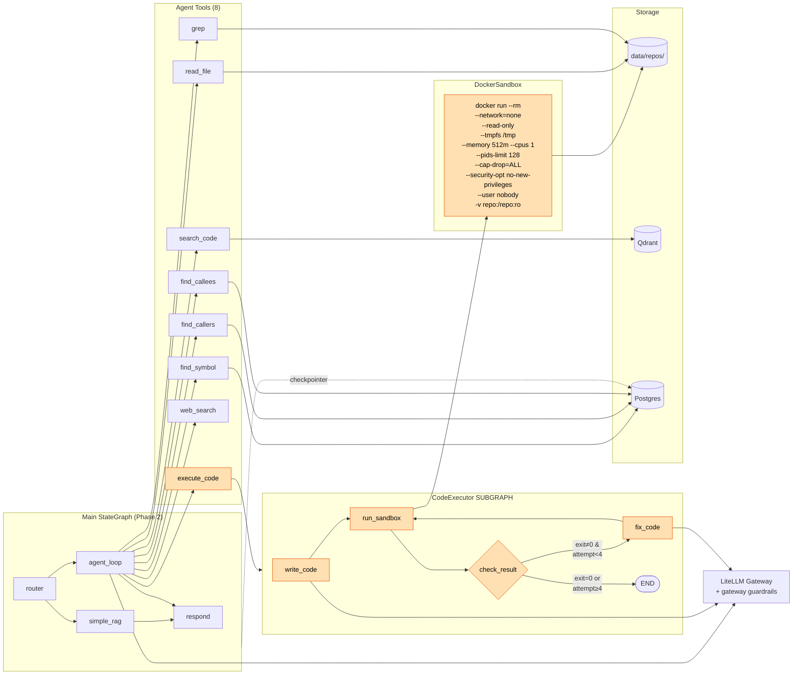
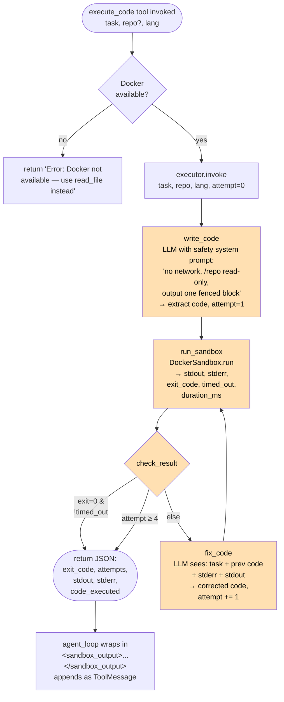
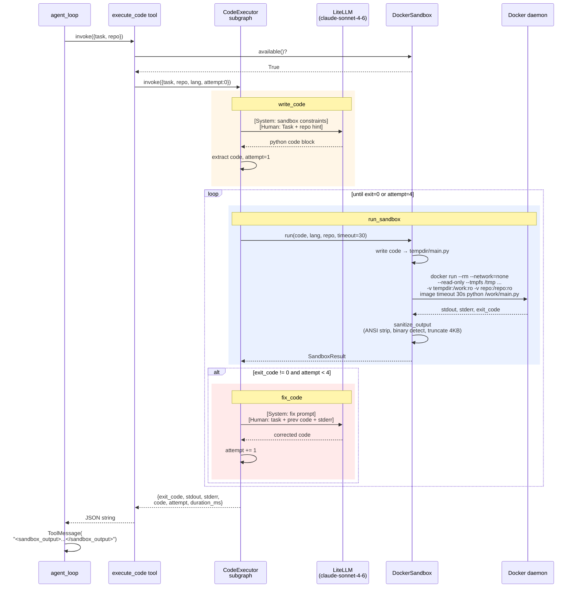
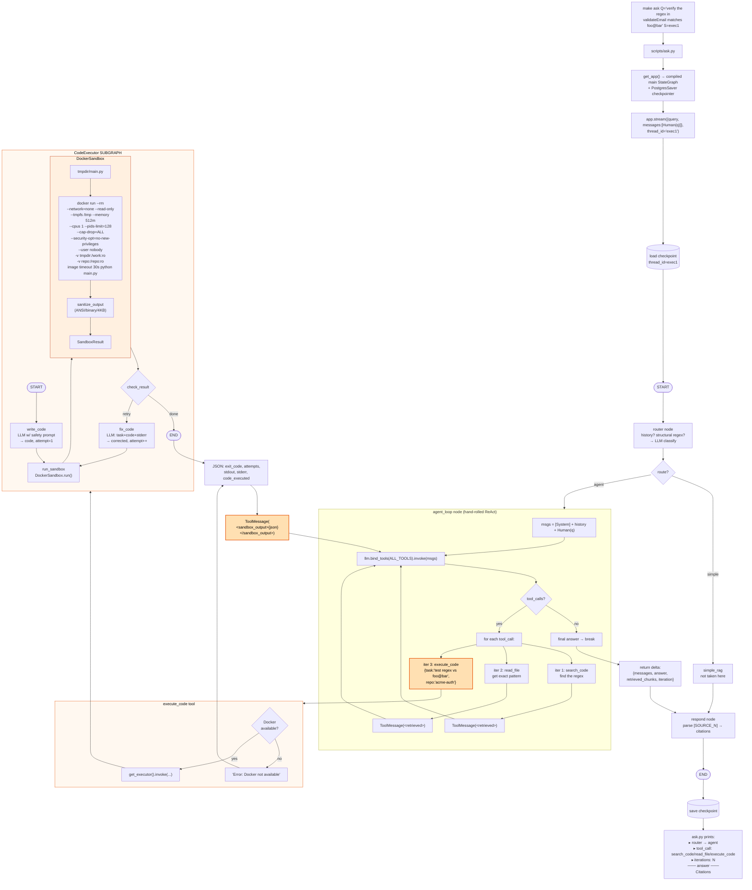
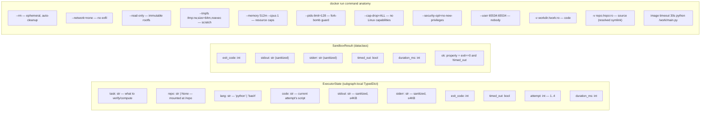
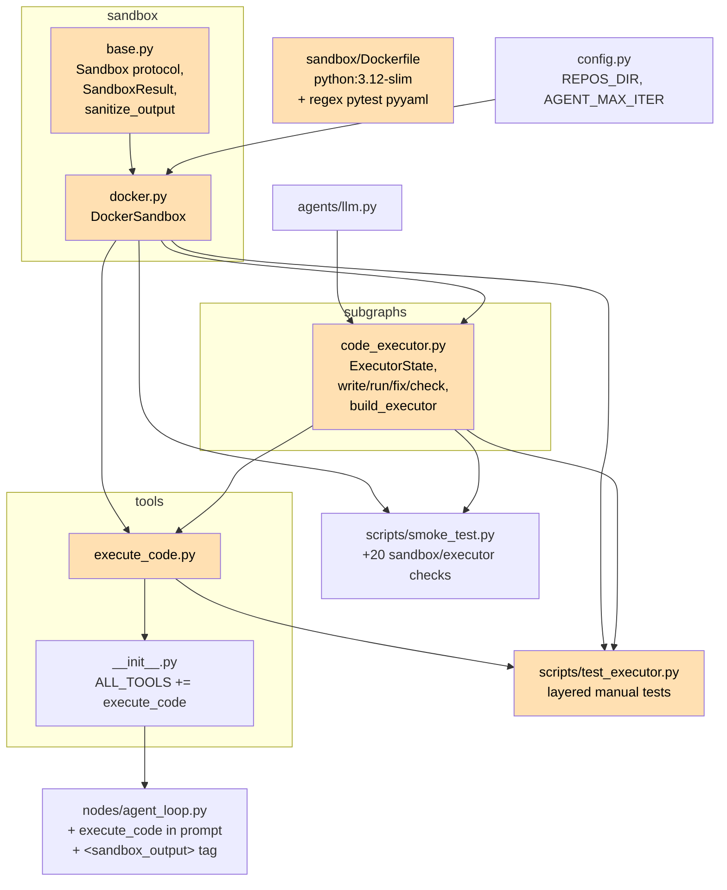

# Phase 3 — Architecture & Code Flow

> CodeExecutor subgraph + Docker sandbox. Adds the `execute_code` tool: agent can write & run Python/bash in an isolated container (no network, read-only FS, repo mounted `:ro`, resource caps) with a write→run→fix retry loop. First multi-agent pattern: supervisor (orchestrator) delegates to worker (executor subgraph).

## 1. System Architecture

## 2. CodeExecutor Subgraph Flow

## 3. Sandbox Run Sequence

## 3b. End-to-End: `make ask` → `execute_code` → sandbox

**Key:** The two compiled graphs (main + executor) are connected only through the `execute_code` tool calling `executor.invoke()` — Pattern C (tool-wraps-subgraph). The main graph never references the subgraph as a node; the orchestrator just sees a tool that happens to run its own state machine internally.

## 4. Data Anatomy

**Defense-in-depth (4 layers, verified by smoke tests):**

| Layer | Mechanism | Defends against | Smoke check |
|---|---|---|---|
| 0. Gateway | gateway guardrails on LiteLLM | Malicious *prompts* reaching the LLM | Discovered via injection test |
| 1. OS isolation | Docker namespaces + `--rm` ephemeral | Persistence, host filesystem access | `Docker available` |
| 2. Capability restriction | `--network=none`, `--read-only`, mem/cpu/pids caps, `--cap-drop=ALL`, `nobody` user | Exfiltration, resource exhaustion, privilege escalation | Network/FS/timeout/forkbomb checks |
| 3. Output sanitization | ANSI strip, binary detect, 4KB truncate, `<sandbox_output>` wrap, system-prompt rule | Prompt injection via stdout, context overflow | Sanitization + injection checks |

## 5. Module Dependency Graph

## 6. Phase 2.5 vs Phase 3 — What Changed

| Aspect | Phase 2.5 | Phase 3 |
|---|---|---|
| Agent capability | Read-only (search, read, grep, graph) | + **Execute** (write & run code in sandbox) |
| Multi-agent pattern | None — single agent with tools | **Supervisor/worker**: orchestrator → CodeExecutor subgraph |
| Agent tools | 7 | **8** (+ `execute_code`) |
| Subgraphs | 0 | **1** (`code_executor`: own state, own loop ≤4, own prompt, no checkpointer) |
| Sandbox | — | DockerSandbox: ephemeral container per run, full hardening |
| Languages executed | — | Python, bash (Option A — no Java compile; verify *about* Java code via scripts) |
| Output handling | Tool results wrapped in `<retrieved>` | + `<sandbox_output>` for execute_code; ANSI/binary/truncate sanitization |
| Prompt-injection defense | `<retrieved>` + system prompt | + `<sandbox_output>` + gateway guardrails (discovered) |
| Smoke tests | 35 | **55** (+15 sandbox isolation, +5 subgraph) |
| New deps | — | None (uses host Docker; subprocess only) |
| New infra | — | `sandbox/Dockerfile` → `cto-sandbox:latest` image |
| Lines added | — | ~720 across 9 new files |

### Bugs found & fixed during Phase 3

| Bug | Fix |
|---|---|
| Test: repo-mount check asserted `'src' in sorted(listdir())[:5]` but dotfiles sort first | Check `os.path.exists('/repo/src')` directly |
| Test: fork-bomb assertion expected `exit≠0`, but contained bomb exits 0 in ~180ms | Assert `not timed_out` and `duration < 7s` instead |
| Injection test routed payload through LLM → blocked by gateway guardrails guardrail | Test sandbox layer directly (no LLM); document gateway as bonus defense layer |

### Measured

| Metric | Value |
|---|---|
| Container spin-up + run + teardown | ~120-200ms (trivial code) |
| Timeout enforcement | Killed at host `timeout+5s` (in-container `timeout 30s` + host fallback) |
| Fork bomb containment | Returned in 182ms, host unaffected (`--pids-limit=128`) |
| Smoke suite | 55/55 passing, ~24s total |
