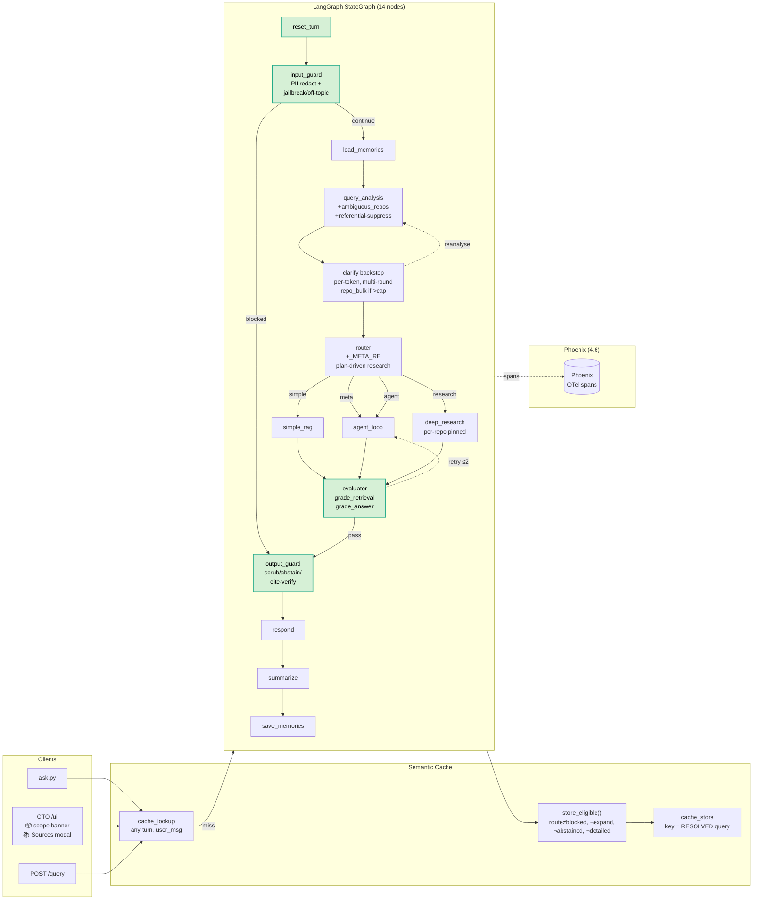
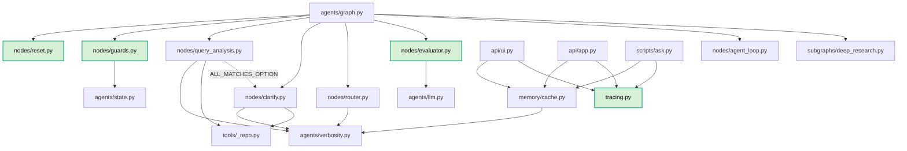
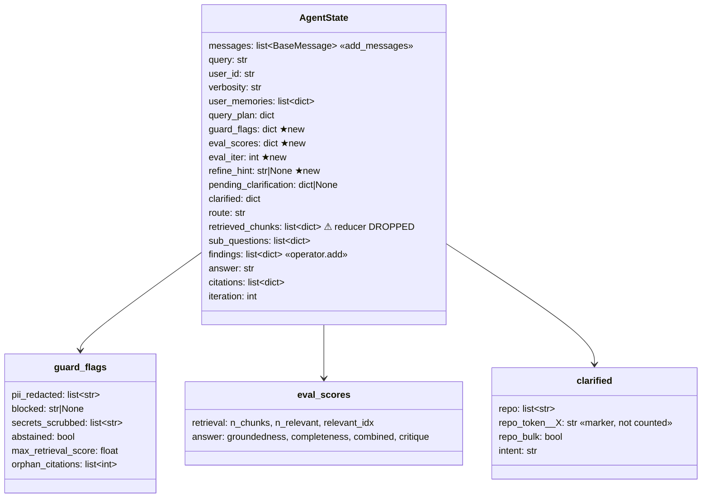

# Phase 4.5 — Architecture & Code Flow

> Guardrails + self-correction + per-turn reset. Adds **`reset_turn`** (always-first state hygiene), reorders **`input_guard`** to run before any LLM call or interrupt, hardens the **multi-round repo-clarify backstop**, adds **`evaluator`** (CRAG retrieval grade + LLM-as-judge answer grade → bounded retry), **`output_guard`** (secret scrub, citation verify, low-confidence abstain), and reworks the **semantic cache** to key on the resolved query with explicit context-dependence gates. Graph grows 10 → 14 nodes. UI is branded **Code / Trace / Origin** (CTO).

## 1. System Architecture



## 2. Per-Turn Sequence (happy path, agent route, 1 retry)

```mermaid
sequenceDiagram
    autonumber
    participant U as User
    participant E as Entry (ui/app/ask)
    participant G as StateGraph
    participant L as LLMs (gateway)
    participant Q as Qdrant
    participant P as Phoenix

    U->>E: "compare jwt in mgmtapi and enrollment"
    E->>Q: cache_lookup(user_msg)
    Q-->>E: miss
    E->>G: stream(inputs, config{callbacks})
    Note over G,P: tracer.__enter__ → using_session/user

    G->>G: reset_turn — zero guard_flags, eval_iter, refine_hint, clarified, …
    G->>G: input_guard — redact PII, check jailbreak/off-topic
    G->>G: load_memories
    G->>L: query_analysis (structured-out)
    L-->>G: QueryPlan{scope=[acme-gateway, acme-auth], intent=compare, needs_human=False}
    G->>G: clarify backstop: 'mgmtapi' has 2 candidates ⊄ scope → interrupt
    G-->>U: ❓ which -api? [acme-api, xt-api, (all)]
    U->>E: "2"
    E->>G: Command(resume="acme-api")
    G->>G: clarify: scope ← (prior − {xt-api,acme-api} − pending_cands) ∪ {acme-api}
    G->>L: query_analysis (re-run, scope locked)
    G->>G: clarify backstop: 'enrollment' has 2 candidates → interrupt (round 2)
    U->>E: "acme-auth"
    G->>G: scope = [acme-auth, acme-api]; query rewritten
    G->>G: router: intent=compare → research
    G->>G: deep_research.planner: per-repo branches, q=plan.search_queries[0]
    par
        G->>Q: hybrid_search(q, repo=acme-auth)
    and
        G->>Q: hybrid_search(q, repo=acme-api)
    end
    G->>L: synthesize (exact repo names)
    G->>G: evaluator — SKIP (route=research)
    G->>G: output_guard — SKIP abstain (route=research); scrub+cite-verify
    G->>G: respond
    G-->>E: answer + citations + eval_scores
    E->>E: store_eligible → key="compare jwt in acme-api and acme-auth"
    E->>Q: cache_store(resolved_key, answer)
    E->>P: push_scores; tracer.flush()
    E-->>U: 📦 Scope banner + answer + 🔍 trace link
```

## 3. Module Dependency Graph



## 4. Data Anatomy — `AgentState` (Phase 4.5 fields)



`reset_turn` zeros: `guard_flags, eval_iter, eval_scores, refine_hint, pending_clarification, clarified, route, retrieved_chunks, citations, sub_questions, findings`. **Not** reset: `messages, query_plan, user_memories` (cross-turn).

## 5. Decision Logic Reference

| Gate | Condition | Outcome |
|---|---|---|
| `input_guard_route` | `_JAILBREAK_RE` ∨ `_OFFTOPIC_RE` matched | `blocked` → output_guard (skip everything) |
| `query_analysis` referential suppress | `needs_human ∧ has_history ∧ ¬ambiguous_repos` | inherit prior `{repo_scope, intent}`, `needs_human=False` |
| `query_analysis` scope lock | `clarified["repo"]` exists | `repo_scope ← prior_scope` (LLM may not add) |
| clarify backstop | token has cands `⊄ scope` ∧ no exact name in query ∧ token ∉ `repo_token:*` | interrupt kind=repo |
| clarify bulk | `len(unresolved) > rounds_left` | single free-form interrupt kind=repo_bulk |
| `should_clarify` cap | `_round_count(clarified) ≥ MAX_CLARIFY_ROUNDS=3` | continue |
| router → research | `intent ∈ {compare, cross_repo_relationship}` ∨ `_RESEARCH_RE` | research |
| router → agent (meta) | `_META_RE` (what repos indexed, list repos, …) | agent (uses repo_info) |
| router → agent (history) | `has_history` (after research/meta checks) | agent |
| router → agent (structural) | `intent=structural` ∨ `_STRUCTURAL_RE` | agent |
| evaluator skip | `route ∈ {simple, blocked, research}` | `{}` |
| evaluator retry | `(a_hint ∨ r_hint) ∧ eval_iter < MAX_EVAL_ITER=2` | `refine_hint=hint` → agent_loop |
| `should_retry` | `bool(refine_hint)` | retry / pass |
| output_guard abstain | `max(rerank_score if present else score) < 0.30 ∧ route ∉ {blocked, research}` | replace answer with ABSTAIN_TEXT |
| `store_eligible` | `verbosity∈{normal,terse} ∧ ¬expand ∧ route∉{None,blocked} ∧ ¬abstained` | store under `final_state["query"]` |

## 6. Phase 4 → 4.5 Comparison

| Aspect | Phase 4 | Phase 4.5 |
|---|---|---|
| Graph nodes | 10 | **14** (`reset_turn`, `input_guard`, `evaluator`, `output_guard`) |
| Node order (head) | `load_memories → query_analysis → clarify → router` | `reset_turn → input_guard → load_memories → query_analysis → clarify → router` |
| Per-turn reset | inside `load_memories` (gated on `ENABLE_MEMORIES`) | dedicated node, **always first** |
| Guard placement | after clarify (LLM call + interrupts before block) | **before** any LLM call or interrupt |
| `guard_flags` lifecycle | copied forward (one block → thread stuck) | fresh `{}` every turn |
| `retrieved_chunks` reducer | `operator.add` (accumulated across turns) | last-write-wins |
| Repo clarify | one round, `"repo" in clarified` gate | per-token (`repo_token:*`), multi-round, scope merge strips pending candidates, `repo_bulk` free-form when > cap |
| `query_analysis` re-run | overwrote scope | scope locked once user clarified; referential follow-ups inherit prior plan |
| Router research trigger | regex only | `plan.intent` (primary) + tightened regex; `_META_RE` for inventory questions |
| `deep_research` planner | zip search_queries↔scope (fragile) | per-repo pinned for compare/cross-repo intents; uses `search_queries[0]` |
| Self-correction | none | `evaluator` (CRAG + LLM-judge) → bounded retry into agent_loop |
| Output safety | none | `output_guard` (secret scrub, abstain, orphan-citation flag) |
| Cache store gate | `fresh` (turn-1 only) | `store_eligible()` (any turn) |
| Cache store key | raw `user_msg` | **resolved** `state["query"]` |
| Expand-request match | bare `more`/`expand`/… | + lead-ins (`provide/give me/can you`), + `on that/this/it` |
| UI | "Agentic RAG", sidebar Sources accordion | **Code / Trace / Origin** header (Space Grotesk) + tagline; 📦 scope/🔎 resolved-query banner; 📚 Sources modal popup; `concurrency_limit=8` on chat |
| Tests | 39 | 39 + 27 (`test_phase4_5.py`) |
| Feature flags | 5 | 7 (`ENABLE_GUARDS`, `ENABLE_EVALUATOR`); **all 128 combos compile** |

## 7. Bugs Found & Fixed (review-driven)

| # | Bug | Root cause | Fix |
|---|---|---|---|
| 1 | Off-topic/jailbreak triggered clarify rounds before block | guard wired after clarify | reorder graph head |
| 2 | One blocked turn → whole thread blocked | `flags = dict(prior)` carried `blocked` | `flags = {}` + reset_turn |
| 3 | Research answer abstained against stale chunks | deep_research didn't write `retrieved_chunks`; reducer accumulated | skip evaluator/abstain on research; drop reducer |
| 4 | `eval_iter` exhausted retry budget for life of thread | never reset across turns | reset_turn |
| 5 | Stale `refine_hint` injected into next turn's prompt | written even on capped pass | `hint if will_retry else None` + reset_turn |
| 6 | `rerank_score=0.0` fell through to RRF score | `or` falsy-zero | key-presence test |
| 7 | Lexical repo backstop unreachable | gated on `not plan` (always non-empty) | gate on candidate-set ⊄ scope |
| 8 | Clarified repo dropped when `ENABLE_QUERY_ANALYSIS=false` | clarify wrote `clarified["repo"]`, downstream read `query_plan` | clarify writes `query_plan.repo_scope` directly |
| 9 | All resets gated on `ENABLE_MEMORIES` | lived in `load_memories` | dedicated `reset_turn` |
| 10 | "more" → clarify interrupt after reorder | query_analysis ran first, didn't recognize expand | `is_expand_request` short-circuit in qa + clarify |
| 11 | Compare query: 2nd ambiguous token never asked | clarify replaced scope; re-analysis unioned alt candidate → cands ⊆ scope | merge strips pending candidates; re-analysis preserves clarified scope verbatim |
| 12 | Round counter double-counted | `repo_token:*` markers in `len(clarified)` | `_round_count()` ignores markers |
| 13 | Referential follow-up ("get the function code") asked needlessly | qa has no history context | suppress `needs_human` when `has_history ∧ ¬ambiguous_repos`; inherit prior plan |
| 14 | Self-symlinked repo → watcher feedback storm | watch on project root sees `data/qdrant` writes | self-loop guard + `data/.venv/.claude` skip lists |

## 8. Files Touched

| File | Δ |
|---|---|
| `agents/graph.py` | reorder; `stages[]` chain; `_attach_to_router`; `_guard_then_clarify` for empty-stages combo |
| `agents/state.py` | +`guard_flags, eval_scores, eval_iter, refine_hint`; `retrieved_chunks` reducer dropped |
| `agents/nodes/reset.py` | **new** |
| `agents/nodes/guards.py` | **new** — `input_guard`, `output_guard`, `redact`, regex sets |
| `agents/nodes/evaluator.py` | **new** — `grade_retrieval`, `grade_answer`, `evaluator`, `should_retry` |
| `agents/nodes/query_analysis.py` | +`ambiguous_repos`; expand short-circuit; referential-suppress; scope-lock; prefix strip |
| `agents/nodes/clarify.py` | `_all_ambiguous_repos`; per-token backstop; `repo_bulk`; scope merge w/ pending strip; `_round_count` |
| `agents/nodes/router.py` | `_META_RE`; plan-driven research; tightened `_RESEARCH_RE` |
| `agents/nodes/{simple_rag,agent_loop}.py` | "use exact repo names" prompt clause |
| `agents/subgraphs/deep_research.py` | per-repo pinned planner; `search_queries[0]`; scope in synth prompt |
| `agents/verbosity.py` | broadened `_EXPAND_RE` (lead-ins, "on that/this/it") |
| `memory/cache.py` | `store_eligible()`; lookup diagnostics |
| `api/ui.py` | Traceline header; resolution banner; Sources modal; `store_eligible`; trace link |
| `api/app.py` | `store_eligible`; `_is_fresh_session` removed; `init_tracing` in lifespan |
| `scripts/ask.py` | `store_eligible`; analysis/clarify trace lines |
| `ingest/{incremental,watcher}.py` | self-loop guard; `data/.venv/.claude` skip |
| `Makefile` | `test-phase4.5`, `test-all`, `trace`, `cache-stats`, `cache-purge`, `ask V=/U=/NO_CACHE=` |
| `scripts/test_phase4_5.py` | **new** — 27 tests |
| `scripts/test_sources_modal.py` | **new** — Playwright modal probe |
