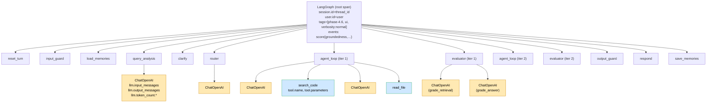
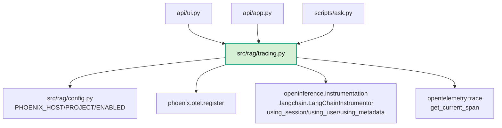
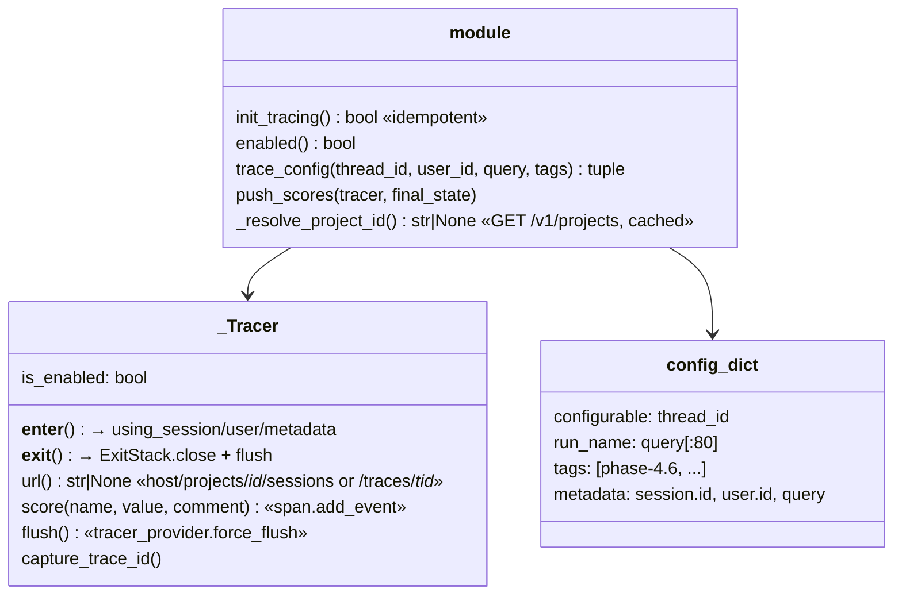

# Phase 4.6 — Architecture & Code Flow

> Observability via **Arize Phoenix** (OpenTelemetry / OpenInference). Auto-instruments LangChain/LangGraph so every node, LLM call, and tool invocation becomes a span — no per-node code changes. One container, SQLite-backed. Replaces the originally-planned Langfuse (v3 self-host needs ClickHouse + Redis + MinIO; v2 SDK incompatible with langchain ≥1.0).

## 1. System Architecture

```mermaid
flowchart LR
    subgraph App["cto process"]
        init["init_tracing()<br/>once, at lifespan/start"]
        reg["phoenix.otel.register()<br/>→ OTLP exporter<br/>→ BatchSpanProcessor"]
        instr["LangChainInstrumentor<br/>.instrument()<br/>monkey-patches<br/>BaseCallbackManager"]
        tc["trace_config(thread_id,<br/>user_id, query, tags)"]
        ctx["_Tracer.__enter__<br/>using_session()<br/>using_user()<br/>using_metadata()"]
        graph["app.stream(inputs, config)"]
        push["push_scores(tracer, final)"]

        init --> reg
        init --> instr
        tc --> ctx
        ctx --> graph
        graph --> push
    end

    subgraph Phoenix["arizephoenix/phoenix container"]
        otlp["/v1/traces<br/>OTLP HTTP"]
        gql["/graphql"]
        rest["/v1/projects"]
        ui["UI :6006<br/>Traces · Sessions · Spans"]
        sqlite[(SQLite<br/>data/phoenix/)]
        otlp --> sqlite
        sqlite --> ui
        sqlite --> gql
        sqlite --> rest
    end

    reg -. exports .-> otlp
    tc -. project-id lookup .-> rest
    push -. span events .-> otlp

    user([User]) --> ui
    user --> App
```

## 2. Span Tree (one turn, agent route + retry)



Each span carries OpenInference attributes: `openinference.span.kind` (`CHAIN`/`LLM`/`TOOL`), `input.value`/`output.value` (the state delta), `llm.model_name`, `llm.token_count.{prompt,completion,total}`, `session.id`, `user.id`, `metadata.tags`.

## 3. Module Dependencies



## 4. `tracing.py` Anatomy



Graceful degradation: `PHOENIX_ENABLED=false` ∨ packages missing ∨ `register()` raises → `_Tracer.is_enabled=False`, all methods no-op, `config` returned without `callbacks`.

## 5. Phase 4.5 → 4.6 Comparison

| Aspect | Phase 4.5 | Phase 4.6 |
|---|---|---|
| Per-request visibility | `print()` lines + UI `▸` trace block | full span tree, every LLM prompt/completion/tokens, tool I/O |
| "Why this route?" | grep server log | click `query_analysis` span → Output |
| Cross-turn view | none | Sessions tab groups by `thread_id` |
| Eval scores | in answer state only | also as span events on root (filterable) |
| Per-node latency | none | every span has start/end + waterfall |
| Token cost | none | per LLM span + roll-up |
| Code changes per node | n/a | **zero** — auto-instrumented |
| Infra | none | 1 container (`arizephoenix/phoenix`), SQLite |
| Entry-point change | `config = {"configurable": ...}` | `config, tracer = trace_config(...)` + `with tracer:` |
| UI link | none | `[🔍 trace](host/projects/<id>/sessions)` under each answer |
| Make targets | none | `make trace [S=<sess>]` |

## 6. Why Phoenix (vs alternatives)

| | Phoenix | Langfuse v3 | LangSmith | Raw OTel |
|---|---|---|---|---|
| Self-host containers | **1** | 4 (web+ClickHouse+Redis+MinIO) | n/a (hosted) | 1 (collector) + DIY UI |
| Wiring | `register()` + `Instrumentor().instrument()` once | `CallbackHandler` per request | env vars + LangChain native | manual spans |
| LangGraph spans | ✅ OpenInference | ✅ | ✅ | ⚠️ generic |
| Open standard | ✅ OTel | partial | ❌ | ✅ |
| Datasets/evals | basic | rich | rich | none |
| Cost | free OSS | free OSS | 💰 | free |
| Switch trigger | trace volume > SQLite comfort, need prompt mgmt | — | want hosted + LangChain-native eval | want Grafana/Tempo fan-out |

## 7. How to Use (quick reference)

```bash
docker compose up -d phoenix     # → http://localhost:6006
make serve                       # init_tracing() runs in lifespan
# ask anything in UI → click 🔍 trace
make trace                       # opens project page
make trace S=ui-fe971444         # opens sessions view
PHOENIX_ENABLED=false make serve # disable (everything still works)
```

In Phoenix: project `cto` → click trace → left = span tree, right = Input/Output/Attributes. Filter by `session.id == "<thread>"` for one conversation.

## 8. Files Touched

| File | Δ |
|---|---|
| `docker-compose.yml` | `phoenix` service (ports 6006, 4317; `data/phoenix/` volume) |
| `pyproject.toml` | `arize-phoenix-otel`, `openinference-instrumentation-langchain` |
| `src/rag/config.py` | `PHOENIX_HOST/PROJECT/ENABLED` |
| `src/rag/tracing.py` | **new** — `init_tracing`, `trace_config`, `_Tracer`, `push_scores`, `_resolve_project_id` |
| `src/rag/api/app.py` | `init_tracing()` in lifespan; `with tracer:` around invoke; `trace_url` in response |
| `src/rag/api/ui.py` | `tracer.__enter__/__exit__` around stream; `🔍 trace` link |
| `scripts/ask.py` | `with tracer:` around stream loop; print trace URL |
| `Makefile` | `trace` target (resolves project name → opaque ID via REST) |
| `.env.example` | Phoenix vars |
