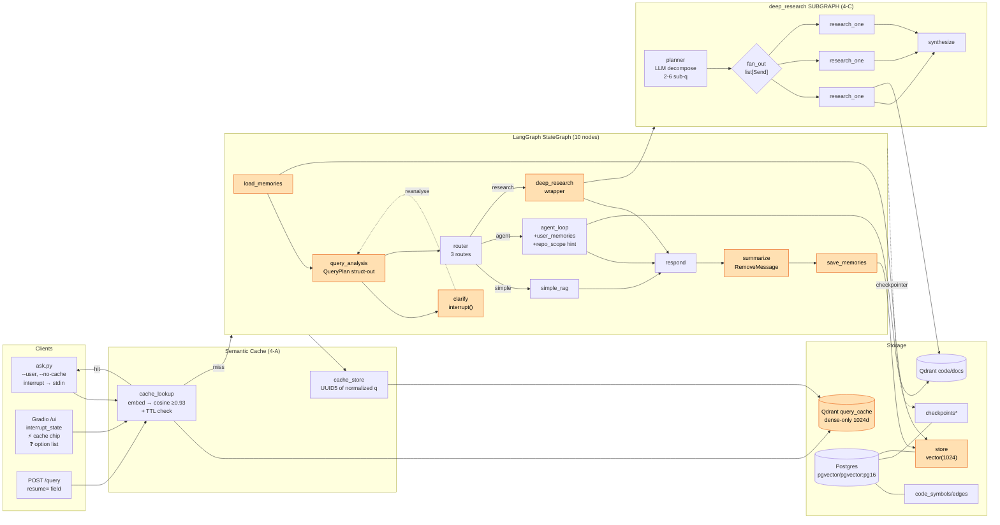
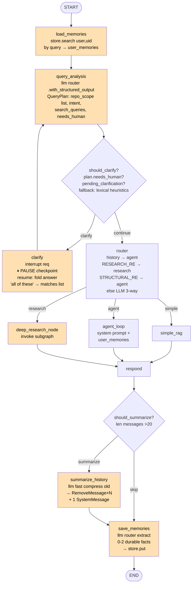
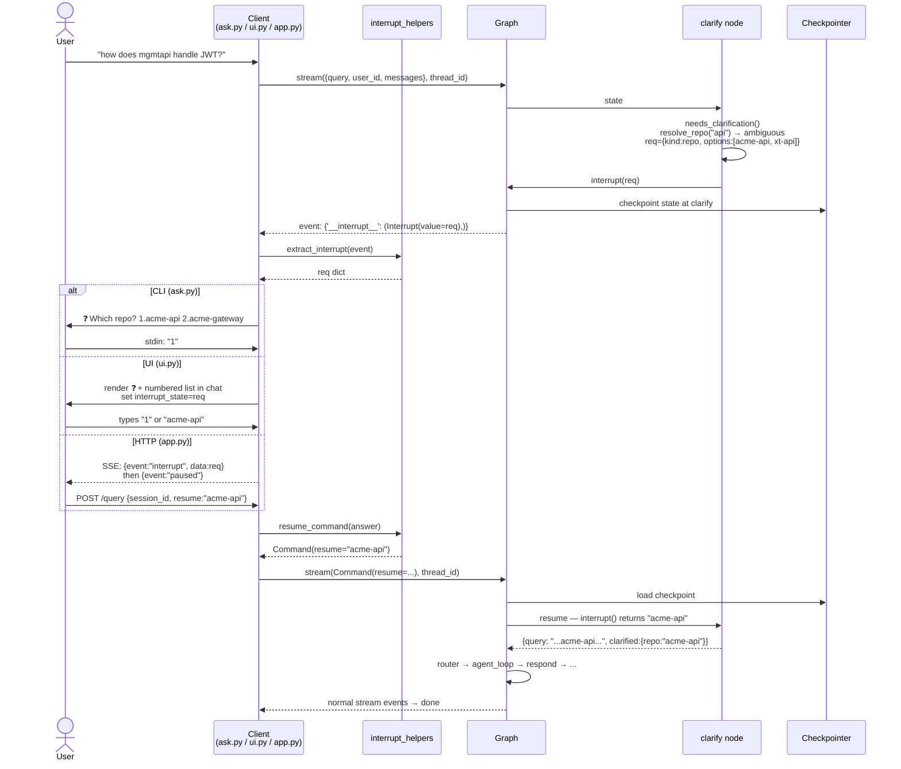
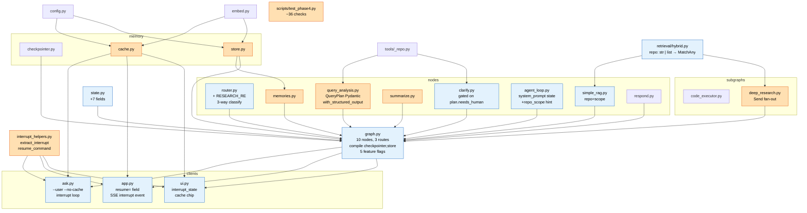

# Phase 4 — Architecture & Code Flow

> Memory layers + parallelism + human-in-the-loop + pre-retrieval query analysis. Six capabilities: (A) semantic query cache, (B) `PostgresStore` cross-session memory, (C) `Send` fan-out `deep_research` subgraph, (D) history summarization via `RemoveMessage`, (E) `interrupt()` clarify node, (F) **`query_analysis`** structured scope/intent extraction. Built via 5 parallel subagents (research) + main-session integration; 4-F added after the "all acme repos → acme-gateway leak" failure. Graph grows from 4 → 10 nodes; router gets a 3rd route.

## 1. System Architecture

## 2. StateGraph Flow (Phase 2 → Phase 4)

## 3. Interrupt Round-trip Sequence

## 4. Data Anatomy — Four Memory Layers

```mermaid
flowchart TB
    subgraph L1["Semantic Cache (4-A) — 'has anyone asked this?'"]
        c1["Qdrant 'query_cache' point<br/>id = UUID5(normalize(query))<br/>vector = embed_query(q) [1024]<br/>payload = {query, answer, citations,<br/>created_at, expires_at}"]
        c2["lookup: cosine ≥ threshold AND expires_at > now<br/>store: upsert (idempotent on normalized q)<br/>purge: DELETE WHERE expires_at < now"]
    end

    subgraph L2["Checkpointer (Phase 2) — 'state of THIS thread'"]
        ck["checkpoints / checkpoint_blobs<br/>keyed by thread_id<br/>auto-saved every node"]
    end

    subgraph L3["Store (4-B) — 'what I know about THIS user'"]
        s1["langgraph PostgresStore<br/>namespace = ('user', user_id)<br/>key = 'fact_<hash>'<br/>value = {text, source_query, ts}<br/>index = {dims:1024, embed:embed_texts}"]
        s2["search(ns, query, limit) — vector kNN over values<br/>put / get / delete"]
    end

    subgraph L4["Summarization (4-D) — 'compress THIS thread'"]
        sm["when len(messages) > 20:<br/>old = msgs[:-6], recent = msgs[-6:]<br/>llm('fast') → 200-word summary<br/>return [RemoveMessage(id) for old]<br/>+ SystemMessage(summary)"]
    end

    subgraph DR["deep_research (4-C) — Send fan-out"]
        d1["ResearchState:<br/>query, sub_questions: list<br/>findings: Annotated[list, operator.add]<br/>answer, citations"]
        d2["fan_out(state) → list[Send('research_one', {sub, query})]<br/>LangGraph runs N copies CONCURRENTLY<br/>operator.add reducer merges findings"]
    end

    subgraph IH["interrupt (4-E)"]
        i1["langgraph.types.interrupt(req) → pause+checkpoint<br/>langgraph.types.Command(resume=ans) → resume<br/>event shape: {'__interrupt__': (Interrupt(value, id),)}"]
    end

    subgraph QA["query_analysis (4-F) — pre-retrieval transformation"]
        q1["QueryPlan (Pydantic, with_structured_output):<br/>repo_scope: list[str] — resolved vs available_repos()<br/>intent: lookup|explain|structural|cross_repo_relationship|compare|debug<br/>search_queries: list[str] — decomposed retrieval queries<br/>needs_human: bool, clarify_question: str|None"]
        q2["consumers:<br/>should_clarify → gate on needs_human<br/>simple_rag → hybrid_search(repo=scope)<br/>agent_loop → scope hint in system prompt<br/>deep_research.planner → reuse search_queries, constrain repos<br/>hybrid_search → MatchAny(any=scope) when list"]
    end
```

## 5. Module Dependency Graph

## 6. Phase 3.5 vs Phase 4 — What Changed

| Aspect | Phase 3.5 | Phase 4 |
|---|---|---|
| Graph nodes | 4 (router, simple_rag, agent_loop, respond) | **10** (+ load_memories, query_analysis, clarify, deep_research, summarize, save_memories) |
| Pre-retrieval transformation | None — raw query → embedding | **`query_analysis`**: Pydantic `QueryPlan` via `with_structured_output`. Resolves `repo_scope: list[str]`, `intent`, decomposed `search_queries`, `needs_human` |
| Repo scope type | `str \| None` (single repo or all) | **`str \| list[str] \| None`** — Qdrant `MatchAny` filter; "all acme repos" → exactly the 3 acme-* names |
| Router routes | 2 (simple, agent) | **3** (+ research) via `_RESEARCH_RE` (compare/audit/vs/across all) |
| Memory layers | 1 (checkpointer per-thread) | **4** (+ semantic cache, cross-session Store, history summarization) |
| Repeated query cost | Full agent run every time | **Cache hit ~50ms** on first-turn near-duplicate (cosine ≥0.93, TTL 1h) |
| Cross-session knowledge | None — fresh thread = blank slate | `PostgresStore` namespaced by `user_id`; `load_memories` injects into system prompt; `save_memories` extracts durable facts |
| Long-conversation cost | Quadratic — every turn re-sends full history | `summarize_history` at >20 msgs: `RemoveMessage` old + 1 `SystemMessage` summary, keep 6 recent |
| Ambiguity handling | `resolve_repo()` returns error string → agent guesses | **`query_analysis`** resolves set descriptors itself; **`interrupt()`** only when `plan.needs_human` (clarify demoted from gatekeeper to fallback) |
| Broad/comparison queries | Sequential `agent_loop` (often hits MAX_ITER=8) | **`Send` fan-out**: planner → N parallel `research_one` → synthesize. Wall-clock ≈ 1 branch |
| `compile()` args | `checkpointer=` | `checkpointer=, store=` |
| AgentState fields | 7 | **14** (+ user_id, user_memories, query_plan, pending_clarification, clarified, sub_questions, findings) |
| Postgres image | `postgres:16` | **`pgvector/pgvector:pg16`** (superset; needed for Store's `vector(1024)` column). No re-indexing |
| Feature flags | — | `ENABLE_{MEMORIES,QUERY_ANALYSIS,CLARIFY,RESEARCH,SUMMARIZE}` for A/B vs Phase 2 |
| Client APIs | `ask.py Q S`; `POST /query {q, session_id}` | `ask.py --user --no-cache`; `POST /query {q, session_id, user_id, use_cache, resume}` |
| New deps | — | None (langgraph already has `Send`/`interrupt`/`PostgresStore`; pgvector via image) |
| Lines added | — | **~1700** across 8 new modules + 9 integrations |
| Tests | ~83 smoke checks | + `test_phase4.py` (~36 checks) |

### How it was built

5 parallel background subagents (one per capability), each constrained to **new files only** (no shared edits → no conflicts). All hit a Write-permission wall (cwd was `acme-auth`); 3 delivered full code in their reports, 2 delivered research only. Main session wrote/built all modules using their interface contracts + verified API paths, then did the integration pass (state/graph/router/clients) sequentially.

### Verified API paths (from agent research)

| API | Path |
|---|---|
| `Send` | `from langgraph.types import Send` (`.constants.Send` deprecated v1.0) |
| `interrupt`, `Command`, `Interrupt` | `from langgraph.types import interrupt, Command, Interrupt` |
| `RemoveMessage` | `from langchain_core.messages import RemoveMessage` (NOT `langgraph.graph.message`) |
| `PostgresStore` | `from langgraph.store.postgres import PostgresStore`; `.from_conn_string(dsn, index={dims, embed})` |
| Interrupt event shape | `{'__interrupt__': (Interrupt(value=req, id=...),)}` under `stream_mode="updates"` |

### Each capability mapped to the problem it fixes

| Capability | Problem observed in earlier phases |
|---|---|
| `query_analysis` (4-F) | "How are all acme repos connected" → lexical clarify treated `acme` as ambiguous singular ref and asked; user picked "(all repos)" which dropped the filter entirely → `acme-gateway` leaked into the answer. Now: LLM resolves `repo_scope=[acme-*×3]` + `needs_human=False`, clarify skipped, retrieval scoped |
| `interrupt()` clarify | `acme-*`/`xt-*` ambiguity → agent guessed; we band-aided with fuzzy-match. Now it **asks** — but only when `query_analysis` can't resolve scope itself |
| Semantic cache | test12 "crypto APIs" took 6 iter / 15s. New session = pay again. Now: 2nd ask ≈ 50ms |
| `PostgresStore` | Fresh `thread_id` → agent forgot you work on enrollment. Now: cross-session facts |
| `Send` deep_research | "compare auth in mgmtapi and enrollment" → 8 iter, hit MAX_ITER. Now: parallel branches |
| Summarization | test12 reached `history_len=27` → 13K tokens/call. Now: compress at 20 |
