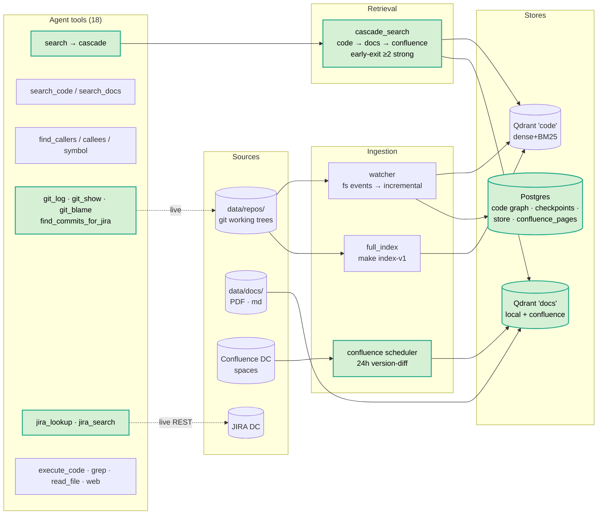
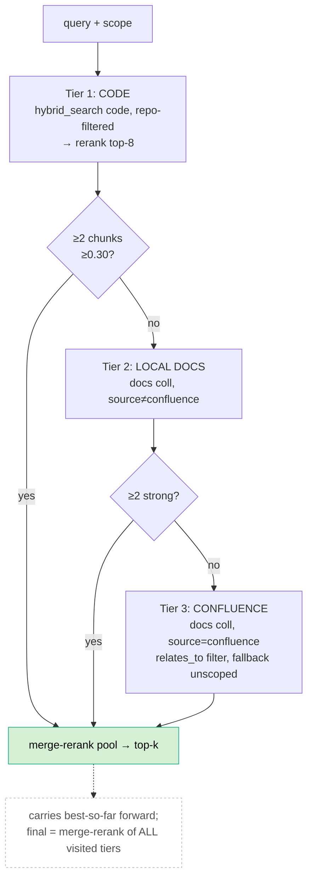
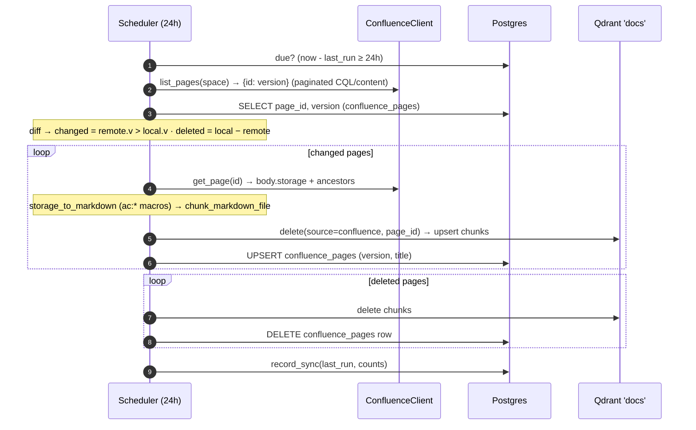
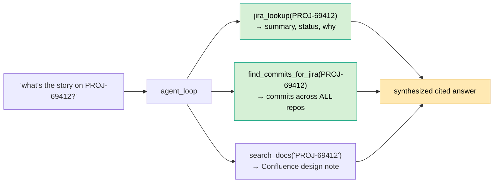
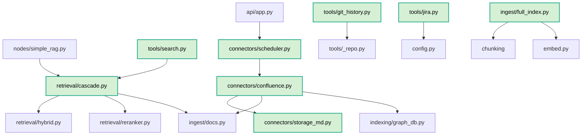

# Phase 5 — Architecture & Code Flow

> Multi-source expansion + tiered retrieval. Adds three new source surfaces — **Confluence** (auto-synced wiki), **git history** (live from `.git`), **JIRA** (live REST lookup) — behind a **tiered retrieval cascade** (code → local docs → Confluence) that early-exits at the first strong tier. Plus guard/routing fixes so general-knowledge answers survive (relatedness bands), doc-intent queries reach the docs, and the cross-source join (ticket → commits → wiki → code) works. Repo reorg: tests → `tests/`, full-index pipeline → a module, Phase-0 baseline → `scripts/legacy/`.
>
> Diverges from the original Phase-5 plan: built **Confluence DC** (not GitLab) + **on-demand git/JIRA tools** (not webhook workers) + the **cascade** (not in the plan). MCP / Slack / GitLab webhooks remain deferred.

## 1. System Architecture

## 2. Retrieval Cascade

`simple_rag` uses it directly; the `search` tool exposes it (agent's default first call). JIRA/git are **not** tiers — they're on-demand API tools, no embeddings (same rationale as their no-index design). Future tiers (JIRA-indexed, logs) slot into `_TIERS`.

## 3. Confluence Connector — version-diff sync

Idempotent on `uuid5(confluence|space|page_id|chunk_idx)`. Chunks land in the existing `docs` collection with `source=confluence`, `url`, `breadcrumb`, `relates_to` (code-symbol linkage). `make confluence-{sync,status,reset}`; scheduler auto-starts in `make serve` lifespan.

## 4. The Cross-Source Join (the differentiator)

No single source answers "why was this built, what code changed, where's it documented" — the agent joins three live/indexed sources into one cited answer.

## 5. Module Dependencies (Phase 5 additions)

## 6. Decision Logic (Phase 5 additions)

| Gate | Condition | Outcome |
|---|---|---|
| router `_DOCS_RE` | runbook/confluence/docs/spec phrasing | → agent (has search_docs) |
| clarify docs-intent skip | `_DOCS_RE` matches | skip repo-disambiguation (docs aren't repo-keyed) |
| cascade early-exit | tier yields ≥ `MIN_STRONG=2` chunks ≥ 0.30 | stop, don't descend |
| hybrid docs repo-filter | `collection==docs` | match `repo` OR `relates_to` (should-clause) |
| output_guard abstain | weak retrieval ∧ answer **cites** chunks | ABSTAIN (confabulation) |
| output_guard band | weak ∧ uncited, score ≥ 0.12 | keep + "domain-adjacent" note |
| output_guard band | weak ∧ uncited, score < 0.12 | keep + "off-domain" note |
| evaluator empty-answer | "nothing found" ∧ <2 chunks | retry with cascade/search_docs hint (no LLM grade) |
| confluence sync | `remote.version > stored.version` | re-index that page only |

## 7. Phase 4.6 → 5 Comparison

| Aspect | 4.6 | 5 |
|---|---|---|
| Sources | code, local docs | + **Confluence**, **git history**, **JIRA** |
| Retrieval | per-collection hybrid+rerank | + **cascade** (code→docs→confluence, early-exit) |
| Tools | 11 | **18** (+search, +4 git, +2 jira) |
| Doc reachability | search_docs (agent only) | simple_rag also via cascade; `_DOCS_RE` routes doc-intent to agent |
| General-knowledge Q | abstain (stream-then-erase bug) | citation-aware abstain + relatedness bands; answer survives |
| Confluence repo filter | n/a | `relates_to` should-clause (pages aren't repo-keyed) |
| Cross-source join | — | ticket → commits → wiki → code in one answer |
| Repo layout | tests + pipeline in scripts/ | tests/ · `ingest/full_index` module · `scripts/legacy/` |
| Tests | 39 + 27 | **39 + 29 + 29** (+ test_confluence) |

## 8. Files (Phase 5)

| File | Role |
|---|---|
| `connectors/confluence.py` | client (DC PAT/Bearer) · version-diff sync · delete_space · sync_status |
| `connectors/storage_md.py` | storage-format XML → markdown (ac:* macros, tables, links, tasks) |
| `connectors/scheduler.py` | 24h per-space daemon, gated on last_run |
| `retrieval/cascade.py` | `cascade_search` tiers + early-exit |
| `tools/search.py` | cascade-backed general search (agent's first call) |
| `tools/git_history.py` | git_log · git_show · git_blame · find_commits_for_jira |
| `tools/jira.py` | jira_lookup · jira_search (live REST, no-op unconfigured) |
| `ingest/full_index.py` | full-rebuild pipeline (extracted from scripts) |
| `scripts/confluence_sync.py` | CLI: --space/--force/--status/--reset |
| `tests/` | all suites + conftest.py |
| `scripts/legacy/` | Phase-0 baseline (index_repos, query) |

## 9. Known Limitations / Follow-ups

- **Relatedness bands are heuristic** (0.30 / 0.12 thresholds, uncalibrated) — planned replacement: LLM `topic` field in query_analysis (approach C, noted in memory).
- **JIRA/git not in cascade** — on-demand only; index JIRA → cascade tier if semantic "tickets about X" is needed.
- **Confluence version-diff misses comment-only edits** (no body version bump).
- **full_index vs incremental** still two code paths to "chunk→embed→upsert" — candidate to unify.
- **MCP / Slack / GitLab webhooks** — original Phase-5 plan items, deferred.
