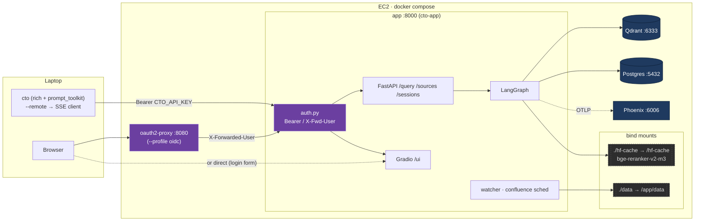
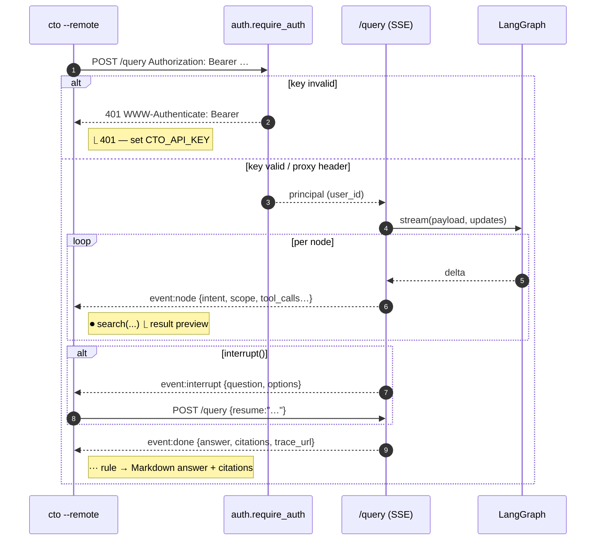
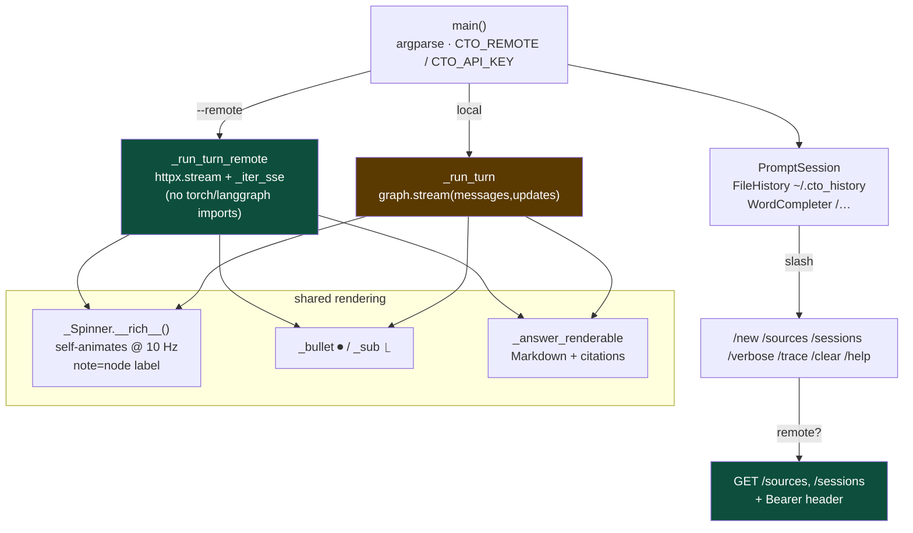
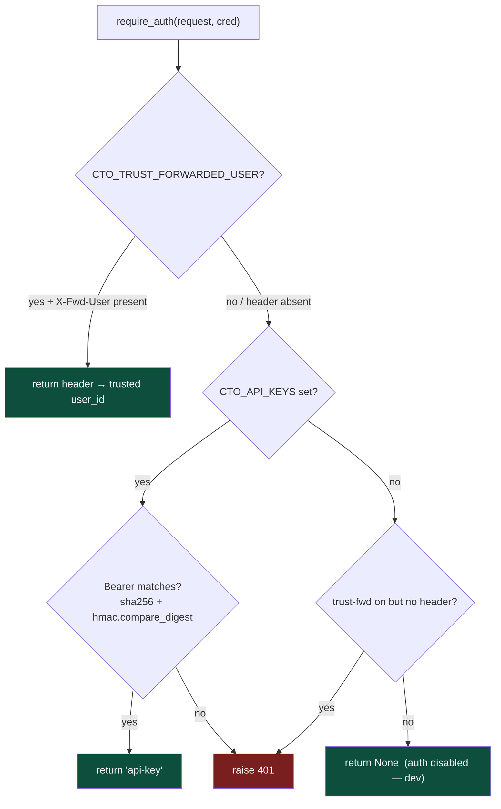

# Phase 6 — Deployment, CLI, Auth

> Containerize the full stack for EC2; add a Claude-Code-style terminal
> client with a thin remote (SSE) mode; gate the API/UI behind
> bearer-key auth with an OIDC upgrade path. Runbook: `DEPLOY.md`.

---

## 1. System

---

## 2. Request flow (remote CLI)

---

## 3. CLI internals

---

## 4. Auth decision tree

`principal` flows into `/query`: when it's a real user (proxy header)
it **overrides** `req.user_id`, so Phoenix `user.id` and the `Store`
namespace become trustworthy.

---

## 5. vs Phase 5

| | Phase 5 | Phase 6 |
|---|---|---|
| Run surface | `make serve` on host | `docker compose`: qdrant + postgres + phoenix + **app** (+ optional oauth2-proxy) |
| Reranker | host venv site-packages | bind-mounted `./hf-cache` (`make prewarm-reranker`) |
| CLI | `scripts/ask.py` (one-shot) | **`cto`** REPL: ⏺/⎿ bullets, self-animating spinner, slash cmds, clarify panel; `--remote` thin SSE mode |
| `/query` SSE | `node`/`done` minimal | + `intent` `repo_scope` `resolved_query` `eval` `refine_hint` `trace_url` |
| Auth | none | bearer keys (`CTO_API_KEYS`), Gradio login (`CTO_UI_USER/PASSWORD`), `X-Forwarded-User` trust, oauth2-proxy compose profile |
| Env | scattered | `.env.example` is exhaustive (33 vars, `[file:line]` refs) |
| Make | `infra` `serve` `ask` | + `chat` `chat-remote` `docker-{build,up,down,logs,shell,exec,restart}` `prewarm-reranker` `gen-api-key` |
| Docs | PHASE5_ARCHITECTURE | + DEPLOY.md (EC2 runbook §1–10), this file |
| Deferred | — | Go remote-CLI (lipgloss/glamour); `PHOENIX_PUBLIC_HOST`; per-user repo ACLs in retrieval |
