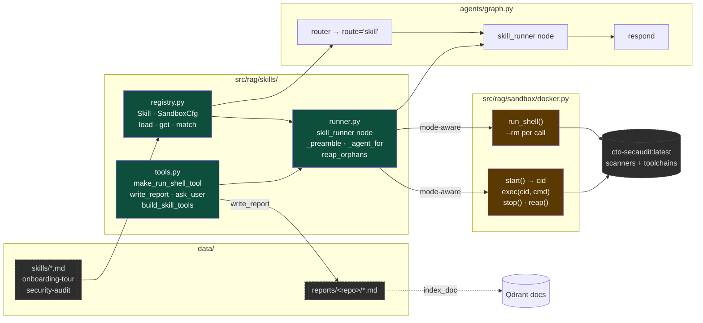
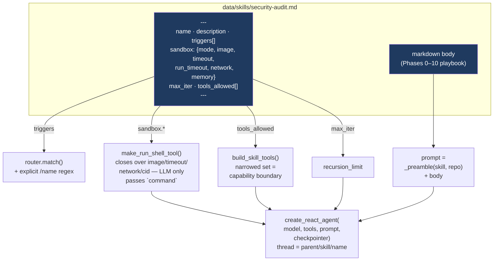
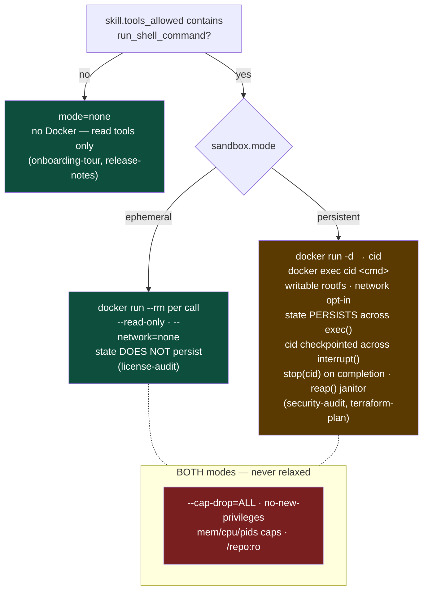

# Phase 7 — Skills: pluggable multi-step playbooks

> A *skill* is a markdown file (`data/skills/*.md`) — frontmatter
> declares triggers, sandbox config, allowed tools, max_iter; the
> body becomes a system prompt. The registry loads them at startup;
> the router dispatches; `skill_runner` wraps `create_react_agent`
> with the narrowed toolset and (for `mode: persistent`) owns a
> per-run Docker container. Reports land in `data/reports/<repo>/`
> and are auto-indexed. Driving example: `security-audit`.

---

## 1. System



---

## 2. Request flow — `/security-audit acme-api`

```mermaid
sequenceDiagram
    autonumber
    participant U as CLI / UI
    participant G as parent graph
    participant SR as skill_runner
    participant A as inner agent<br/>(create_react_agent)
    participant D as Docker<br/>cto-skill-*

    U->>G: stream(payload, ["messages","updates","custom"])
    G->>G: reset_turn → input_guard → query_analysis
    G->>G: router: get("security-audit") → route=skill
    G->>SR: skill_runner(state)
    SR->>D: start(image=cto-secaudit, repo, network=true) → cid
    SR->>U: write({skill_event: start})  ⏺ skill … [persistent]
    SR->>A: agent.stream({messages}, inner_cfg)
    loop ReAct (≤ max_iter)
      A->>A: LLM → tool_calls
      SR-->>U: write({tool_call})  ⏺ run_shell_command(...)
      A->>D: exec(cid, "<cmd>")
      Note right of D: /repo :ro · /work persists<br/>installs survive across calls
      D-->>A: stdout/stderr → ToolMessage
      SR-->>U: write({tool_result})  ⎿ preview…
    end
    opt ask_user
      A-->>SR: __interrupt__(question)
      SR-->>G: interrupt(question)  [parent-level]
      G-->>U: ❓ panel
      U->>G: Command(resume="yes")
      G->>SR: re-enter; interrupt() returns "yes"
      SR->>A: Command(resume="yes")
    end
    A->>A: write_report(repo, file, md)
    A-->>SR: final AIMessage (no tool_calls)
    SR->>D: stop(cid)
    SR-->>U: write({skill_event: end})
    SR-->>G: {answer, messages, route=skill}
    G->>G: → respond → save_memories → END
    G-->>U: answer + ⏱/route footer
```

---

## 3. Skill anatomy



---

## 4. Two-mode sandbox decision



---

## 5. vs Phase 6

| | Phase 6 | Phase 7 |
|---|---|---|
| Routes | simple · agent · research · intro · blocked | + **skill** |
| Graph nodes | 17 | 18 (`skill_runner`) |
| `state` | — | + `skill_name` `skill_cid` |
| `DockerSandbox` | `run()` only — script-file, `--rm`, hardcoded image/30s/no-net | + `run_shell()` knobs; **persistent** `start/exec/stop/alive/reap`; `_isolation_flags()` shared |
| New package | — | `src/rag/skills/` (registry · tools · runner) |
| New tools (skill-only) | — | `run_shell_command` (factory-built, mode-aware) · `write_report` (path-jailed, auto-index) · `ask_user` (interrupt() in-tool, verified) · `write_todos` · `grep_search` |
| `data/` | repos · docs · connectors | + `skills/*.md` · `reports/<repo>/` |
| Images | `cto-sandbox` | + `cto-secaudit` (semgrep/trivy/gitleaks/tfsec/checkov/bandit/pip-audit/osv-scanner + node/go/jdk/maven/gradle/ruby/cargo) |
| Streaming | messages + updates | + **custom** (`skill_event` start/tool_call/tool_result/end) → live ⏺/⎿ in CLI/UI/SSE |
| Invocation | — | `/skills` · `/<name> [repo]` · trigger regex · `run skill <name>` · `GET /skills` |
| `make` | — | `sandbox-secaudit[-check]` · `sandbox-reap` |
| Lifespan | watcher · confluence · reranker-warm | + `reap_orphans()` · `load_skills()` |
| Skipped routes (eval/cache/abstain) | intro · blocked · research | + skill |
| Verified | — | sandbox both modes (state persists, `/repo:ro`, reap); registry fail-soft; 3 invocation paths route; write_report path-jail; interrupt()-in-tool with PostgresSaver |
| Known limits | — | inner-interrupt bridge handles ONE `ask_user` per run cleanly; secaudit image not yet built/tested live; UI tool-call rendering for skill route untested in browser |
