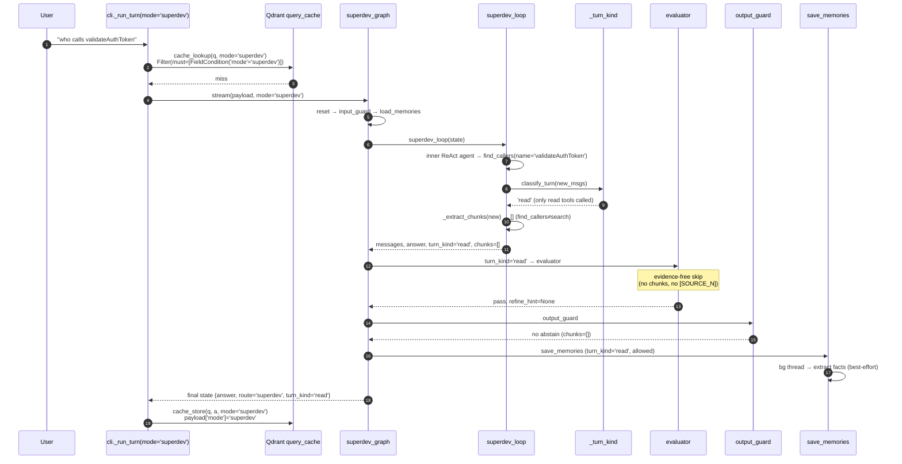

# Phase 8.5-G — `/superdev` wrapped with regular's quality pipeline

> Phase 8.5 (A/B/C) gave `/superdev` RAG tools, playbooks, and
> glob/patch/todo. Phase 8.5-G **wraps the read-only graph's
> quality stages around `superdev_loop`** without unifying the
> two graphs: memories load at entry, evaluator + output_guard
> grade read turns, summarize compresses tool-chain-aware
> history, save_memories mines durable facts. Mode-aware — action
> turns (commit/edit/host_shell) skip eval + cache so non-
> idempotent answers don't poison the cache or burn LLM tokens on
> grading a `git commit` message.

---

## 1. System

```mermaid
flowchart LR
    subgraph cli["api/cli.py"]
      RT["_run_turn(graph, ..., mode)"]
      LK["cache_lookup(q, mode='superdev')"]
      ST["cache_store(q, a, c, mode='superdev')"]
      KIND["loop var = kind (was `mode`)"]
      OVR["text overlay = None<br/>(no flashing Markdown)"]
    end

    subgraph wrap["agents/superdev_graph.py — 8.5-G wrapper"]
      RST["reset (reset_turn + route='superdev' + turn_kind='')"]
      IG["input_guard"]
      LM["load_memories"]
      LOOP["superdev_loop<br/>+ classify_turn(new)<br/>+ _extract_chunks(new)"]
      ER{{"_eval_route<br/>'read' → evaluator<br/>action → skip"}}
      EV["evaluator (shared)"]
      OG["output_guard (shared)"]
      RES["respond (shared)"]
      SUM{{"should_summarize"}}
      S["summarize_history (shared)"]
      SM["save_memories (shared)"]
      END_["END"]
    end

    subgraph tk["agents/_turn_kind.py — NEW"]
      RT2["READ_TOOLS<br/>(host_read, search_*, find_*,<br/>grep, jira_lookup, todo, …)"]
      RM["READ_MCP_BASES<br/>(read_file, fetch, …)"]
      CT["classify_turn(new) → 'read'|'action'"]
    end

    subgraph nodes["agents/nodes/* — SHARED with regular graph"]
      MEM["memories.py<br/>+ skip if superdev & turn_kind!='read'"]
      EVAL["evaluator.py<br/>+ skip if superdev & turn_kind='action'<br/>+ skip evidence-free turns<br/>+ refine_hint=None for superdev"]
      SUM2["summarize.py<br/>+ _safe_split (tool-chain-aware)"]
      OUT["guards.py output_guard"]
      RESP["respond.py"]
    end

    subgraph cache["memory/cache.py"]
      MS["_normalize(q, mode) → 'mode::query'"]
      QF["Qdrant Filter:<br/>must=FieldCondition(mode)<br/>regular ORs IsEmptyCondition"]
      SE["store_eligible:<br/>reject if superdev & turn_kind!='read'"]
    end

    RT --> LK --> wrap
    RT --> ST
    wrap --> RST --> IG --> LM --> LOOP --> ER
    ER -->|grade| EV
    ER -->|skip|  OG
    EV --> OG --> RES --> SUM
    SUM -->|summarize| S --> SM
    SUM -->|skip|      SM
    SM --> END_

    LOOP -.uses.- CT
    CT -.- RT2
    CT -.- RM
    EV -.same fn.- EVAL
    OG -.same fn.- OUT
    RES -.same fn.- RESP
    S  -.same fn.- SUM2
    LM -.same fn.- MEM
    SM -.same fn.- MEM

    LK -.- QF
    ST -.- MS
    ST -.- SE

    classDef new fill:#3a3,color:#fff,stroke:#0a0
    classDef shared fill:#338,color:#fff,stroke:#06a
    class RST,LOOP,ER,RT2,RM,CT,KIND,OVR new
    class EV,OG,RES,S,SM,LM,MEM,EVAL,SUM2,OUT,RESP shared
```

**One-way reuse:** the wrapper IMPORTS regular graph's node
functions. Regular graph (`agents/graph.py`) still doesn't
import anything superdev-specific. Single source of truth per
node.

---

## 2. Per-turn flow (mode-aware routing)



Action-turn variant (commit/edit): step 8 classifies as
`'action'`; `_eval_route → 'skip'`; evaluator skipped (no
answer to grade); save_memories skipped (turn_kind ≠ 'read');
store_eligible rejects (`route='superdev' and turn_kind='action'`)
so the commit-sha answer never lands in cache.

---

## 3. Components

### 3.1 `agents/_turn_kind.py` — NEW

| Constant / fn | Purpose |
|---|---|
| `READ_TOOLS` | Allowlist of non-mutating native tool names (search/find/grep/read_file/host_read/host_glob/git_log/etc + todo/ask_user) |
| `READ_MCP_BASES` | Allowlist of read-only MCP tool basenames (read_file, fetch, search_files, list_*) |
| `classify_turn(new_msgs) → 'read'\|'action'` | Walks each `AIMessage.tool_calls`; first non-read tool → 'action'; default 'read' |

MCP names are `<server>__<tool>`; classifier strips prefix
before lookup.

### 3.2 `agents/superdev_graph.py` — rewired

| Change | What |
|---|---|
| `reset` | Wraps `reset_turn(state)` + stamps `route='superdev'`, `turn_kind=''` |
| `superdev_loop` | After streaming inner ReAct, calls `classify_turn(new)` to set `turn_kind`; calls `_extract_chunks(new)` to populate `retrieved_chunks` from search/search_code/search_docs ToolMessages |
| `_eval_route` | Conditional edge: `'read' → evaluator`, else `'skip' → output_guard` |
| System prompt | Adds **Repo scope rule** (omit `repo=` unless user named one) + **Citations block** ([SOURCE_N] + footnote convention, read-turn only) |
| Wiring | `reset → input_guard → load_memories → superdev_loop → [eval_route] → evaluator → output_guard → respond → [should_summarize] → summarize → save_memories → END` |
| `store` | `get_store()` at compile time (fail-soft) for memory persistence |

### 3.3 Shared nodes — patched for cross-graph use

| Node | Patch |
|---|---|
| `nodes/evaluator.py` | (a) skip superdev action; (b) skip evidence-free turns (no chunks AND no `[SOURCE_N]`); (c) force `will_retry=False` for `route='superdev'` in both empty-answer fast-path and full-grading path — superdev wrapper has no retry edge |
| `nodes/memories.py` | skip `save_memories` when `route='superdev' and turn_kind != 'read'` |
| `nodes/summarize.py` | new `_safe_split(messages, keep_recent)` walks backward past `AIMessage(tool_calls)` ↔ `ToolMessage` chains so a summary never severs a pair; returns 0 if walk hits index 0 (no-op rather than malformed Anthropic payload) |
| `nodes/guards.py` `output_guard` | unchanged behavior — same node used by both graphs |

### 3.4 `memory/cache.py` — mode-scoping

```
            cache_lookup(q, mode='superdev')
                     │
                     ▼
       Qdrant query_filter:
       ┌─────────────────────────────────┐
       │ if mode == 'regular':           │
       │   Filter(should=[               │
       │     FieldCondition(mode=='reg') │
       │     IsEmptyCondition('mode')    │   ← legacy entries
       │   ])                            │
       │ else:                           │
       │   Filter(must=[                 │
       │     FieldCondition(mode=='X')   │
       │   ])                            │
       └─────────────────────────────────┘
                     │
                     ▼
         post-filter: TTL only

  cache_store(q, a, c, mode='superdev')
       _point_id = UUID5('superdev::' + normalized_q)
       payload['mode'] = 'superdev'
```

- **No cross-mode collisions:** `_point_id` namespaces by mode, so a regular and a superdev answer for the same paraphrase get distinct Qdrant points.
- **Server-side filter:** `limit=3` is enough — wrong-mode entries no longer crowd out the right hit.
- **Backward-compat:** pre-8.5-G entries (no `mode` field) still match `mode='regular'` lookups via the `IsEmptyCondition` OR-fallback.

### 3.5 `api/cli.py` — superdev cache + clean trace

| Change | Why |
|---|---|
| `_run_turn(..., mode: str = "regular")` | thread mode through cache_lookup/store |
| Superdev branch passes `mode="superdev"`, `use_cache=use_cache` (was hardcoded `False`) | superdev read-turn answers now cacheable |
| `for kind, data = ev` (was `mode, data = ev`) | unshadow the function param so `cache_store(..., mode=mode)` actually receives 'superdev' not 'custom'/'messages' |
| `text` skill_event drops Markdown overlay; only `spin.note = "streaming (N chars)"` | superdev agents echoed code/doc snippets while reasoning → flashed on screen |
| `tool_result` clears stale `streaming` + `spin.above` | prevent prior thinking-round text bleeding into next round |

UI + app got the same `kind, … = ev` rename prophylactically.

### 3.6 `retrieval/graph_query.py` — case-insensitive callers/callees

`find_callers` / `find_callees` used `name = %(name)s` (case-
sensitive) AND `e.callee_name = %(name)s`. LLM-lowercased
queries (`validateauthtoken`) missed the indexed `validateAuthToken`. Both
queries now take `case_sensitive: bool = False` and use ILIKE
by default — parity with `find_symbol` (patched earlier).

Tool wrappers (`tools/find_callers.py`, `tools/find_callees.py`)
expose the kwarg in their schema so the LLM can opt into
case_sensitive=True for strict matches.

---

## 4. What's reused vs new (LOC accounting)

| Layer | Reused (same code, both graphs) | New |
|---|---|---|
| Node implementations | `memories.py`, `clarify.py`, `query_analysis.py`, `evaluator.py`, `guards.py`, `summarize.py`, `respond.py`, `reset.py` | 0 |
| Cache | `cache.py` (one module) | mode-param thread (~30 LOC) |
| Wiring | each graph file has its own builder | superdev_graph rewiring (~60 LOC) |
| Turn classification | — | `_turn_kind.py` (57 LOC) |
| Tool-chain-safe split | `nodes/summarize.py` (benefits both) | `_safe_split` (~25 LOC) |

Net wrapper-attributable code: **~260 LOC**, of which
**~150 LOC is superdev-only** wiring + helpers; rest is
backward-compatible widening of shared infrastructure.

---

## 5. Trace parity (regular vs superdev)

Both graphs now emit the same `updates`-mode events for
`load_memories` / `evaluator` / `output_guard` / `summarize` /
`save_memories`, so the CLI's existing bullet handlers
(`⏺ memories loaded N`, `⎿ eval: grounded=… complete=…`)
render identically. Superdev keeps its `custom`-stream
`skill_event{tool_call,tool_result,text,todo}` for the live
⏺/⎿ rendering of the inner agent's tool use.

All pipeline `print(...)` statements in `nodes/{guards,
evaluator,summarize,clarify,query_analysis,router,simple_rag,
memory.cache}` converted to `log.debug/info/warning`. Verified
`grep -rn "^\s*print(" src/rag/agents src/rag/memory` → empty.

---

## 6. Stdout-noise inventory before vs after

| Was on stdout | Now |
|---|---|
| `[input_guard] redacted ...` | log.debug |
| `[output_guard] abstaining ...` | log.info |
| `[evaluator] iter=N retrieval=...` | log.debug |
| `[summarize] compressed N msgs` | log.debug |
| `[cache_lookup] best=… <thr` | log.debug |
| `[router] history_len=... query=...` | log.debug |
| `[query_analysis] intent=... scope=...` | log.debug |
| `[clarify] kind=… → interrupting` | log.debug |
| `[simple_rag] cascade visited=...` | log.debug |
| Streaming Markdown overlay for superdev text deltas | gone — `spin.note = "streaming (N chars)"` only |

User sees only: CLI bullets + spinner + permanent final answer
+ trace URL footer. No debug breadcrumbs leaking on stdout.

---

## 7. Known follow-ups (not in 8.5-G scope)

| Item | Owner |
|---|---|
| Single source of truth for tool-mutation classification (collapse `_turn_kind.READ_TOOLS` ↔ `host._RAG_TOOL_NAMES` ↔ `mcp/tools._MUTATE_RE`) | future cleanup |
| Extract `_extract_chunks` shared helper (3 copies in agent_loop.py × 2 + superdev_graph.py × 1) | future refactor |
| Lift `_safe_split` to `langchain_core.messages.trim_messages` (drop in-house copy) | optional |
| Generalize evaluator skip predicate to a per-route `gradable: bool` registration | when 4th route lands |
| If `/superdev` ever ships in UI/app, thread `mode="superdev"` to their cache_lookup/store calls | when needed |

---

## 8. Phase 8.5 vs 8.5-G comparison

| Aspect | 8.5 | 8.5-G |
|---|---|---|
| superdev pipeline | reset → input_guard → superdev_loop → respond → END | reset → input_guard → load_memories → superdev_loop → [eval/skip] → output_guard → respond → [summarize?] → save_memories → END |
| Cross-session memory in superdev | none | load + save (read-turn only) |
| Answer quality gating | none | evaluator (read turn, evidence-bearing) + output_guard |
| History compression | none in superdev | summarize (tool-chain-safe, both graphs) |
| Cache | disabled (`use_cache=False`) | mode-scoped enabled (`mode='superdev'`); action turns rejected by `store_eligible` |
| Agent's lookup repo scope | guessed cwd (`repo='<cwd-repo>'` for everything) | system-prompt rule: omit `repo=` unless user named one |
| Citations | none — prompt never mentioned `[SOURCE_N]` | `[SOURCE_N]` + footnote block (read turns) |
| Case-insensitive find_callers/callees | broken (case-sensitive `=`) | ILIKE default, `case_sensitive=True` opt-in |
| Stdout noise (debug prints) | many | none in pipeline |
| Text-overlay flashing during inner agent thinking | yes | dropped |
