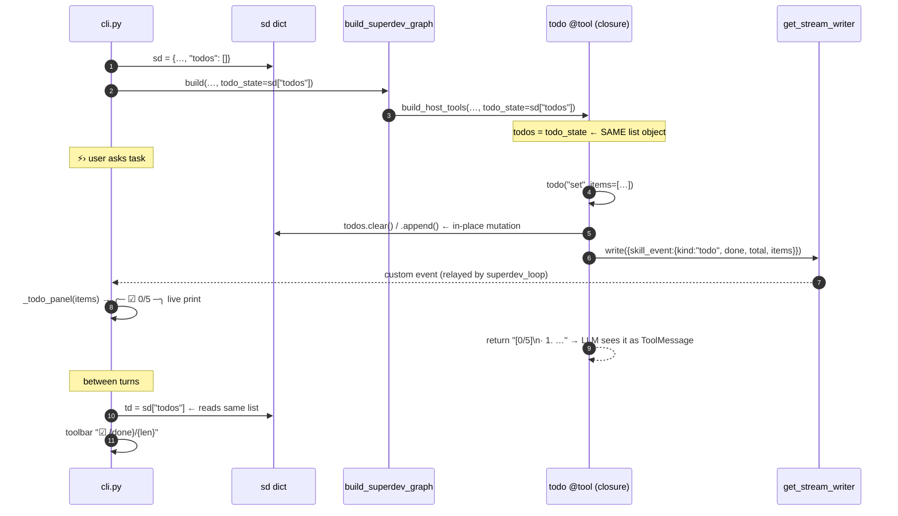

# Phase 8.5 — `/superdev` as a RAG-aware coding assistant

> Phase 8 gave `/superdev` host write access on a worktree.
> Phase 8.5 gives it **eyes** (the read-only graph's RAG
> tools, so edits are informed by the whole indexed corpus),
> **discipline** (composable methodology playbooks), and
> **ergonomics** (glob, multi-file patch, live checklist). The
> result reads like CTO and writes like Claude Code — neither
> alone has both.

---

## 1. System

```mermaid
flowchart LR
    subgraph cli["api/cli.py"]
      SLASH["/superdev [repo] [pb pb…]<br/>/playbook &lt;name&gt; · /playbooks"]
      SD[["sd = {wt, cwd, roots,<br/>playbooks:[], todos:[]}"]]
      TB["toolbar: 📖 pb,… · ☑ N/M"]
      PNL["_todo_panel(items)"]
    end

    subgraph graph["agents/superdev_graph.py"]
      BLD["build_superdev_graph(<br/>wt, roots, playbooks, todo_state)"]
      PR["prompt = render(playbooks)<br/>+ _system_prompt(wt)"]
      LOOP["superdev_loop<br/>stream_mode=[updates,<br/>messages,custom]"]
    end

    subgraph pb["agents/playbooks.py"]
      LST["list_playbooks()"]
      RND["render([names])<br/>'# Active Playbooks…STRICTLY'"]
      MD[["data/playbooks/*.md<br/>tdd · plan-then-execute<br/>systematic-debugging<br/>verify-before-done"]]
    end

    subgraph host["agents/tools/host.py"]
      H8["8-C: host_shell/read/<br/>write/edit, docker_run,<br/>commit, create_pr, ask_user"]
      RAG["8.5-A: _rag_tools()<br/>search_code · find_symbol<br/>find_callers/callees · grep<br/>read_file · repo_info<br/>git_log/show/blame · search_docs"]
      QOL["8.5-C: host_glob<br/>host_apply_patch<br/>todo(set|add|done|show)"]
    end

    RO[("agents/tools/__init__<br/>TOOLS_BY_NAME")]

    SLASH --> SD
    SD -->|playbooks, todo_state| BLD
    SD -.same list obj.-> QOL
    SD -.read.-> TB
    BLD --> PR
    RND --> PR
    MD --> RND
    LST --> SLASH
    BLD -->|tools=| H8 & RAG & QOL
    RO -.lazy import.-> RAG
    LOOP -->|skill_event{todo,items}| PNL
    QOL -->|get_stream_writer()| LOOP

    classDef new fill:#0d4f3c,color:#fff
    classDef ext fill:#5a3a00,color:#fff
    classDef file fill:#2d2d2d,color:#ddd,stroke:#555,stroke-dasharray:3
    class RAG,QOL,RND,LST,BLD new
    class H8,LOOP,PR ext
    class MD,RO,SD file
```

**Isolation still holds:** `host.py` imports `TOOLS_BY_NAME`
(one-way, lazy), but the read-only graph still never imports
`host.py`. Superdev *gains* read tools; the read-only graph
gains nothing.

---

## 2. The shared-list mechanism (`todo` + toolbar)



Three consumers, one list: the **LLM** (return value →
ToolMessage), the **live trace** (`skill_event` via custom
stream → `_todo_panel`), the **toolbar** (direct read of
`sd["todos"]` between turns). `.clear()`/`.append()` not
reassignment, so the closure and `sd` never diverge.

---

## 3. Playbook composition

```
/superdev acme-auth tdd plan-then-execute
                    └─────────┬──────────┘
                              ▼
              playbooks = ["tdd", "plan-then-execute"]
                              │
                              ▼
   render(["tdd","plan-then-execute"])
   ┌────────────────────────────────────────┐
   │ # Active Playbooks                      │
   │ Follow these workflows STRICTLY …       │
   │                                         │
   │ ## Playbook: tdd                        │
   │ **RED · GREEN · REFACTOR** …            │
   │ ---                                     │
   │ ## Playbook: plan-then-execute          │
   │ **No edits before a checklist** …       │
   │ ---                                     │
   └────────────────────────────────────────┘
                              │ prepended
                              ▼
   _system_prompt(wt, base)
   ┌────────────────────────────────────────┐
   │ You are CTO in superdev mode …          │
   │ Tools: host_shell / … / search_code …   │
   │ **Never end a turn with uncommitted     │
   │ changes** — last calls MUST be commit   │
   │ then ask_user("Open a PR?") …           │
   └────────────────────────────────────────┘
                              │
                              ▼
        create_react_agent(prompt=…, tools=24)
```

`/playbook <name>` mid-session: append to `sd["playbooks"]`,
`_rebuild_sd_graph()`. Graph recompiles (~50 ms); worktree,
`sd["todos"]`, and the inner checkpoint thread survive.

---

## 4. Toolset (worktree mode — 26 tools)

| Group | Tools | Source |
|---|---|---|
| **Host write** (8-C) | `host_shell` `host_write` `host_edit` `docker_run` `commit` `create_pr` `ask_user` `host_read` | `host.py` closures over `wt`/`roots` |
| **RAG read** (8.5-A) | `search_code` `find_symbol` `find_callers` `find_callees` `grep` `read_file` `repo_info` `git_log` `git_show` `git_blame` `find_commits_for_jira` `search_docs` | lazy `from . import TOOLS_BY_NAME` |
| **QoL** (8.5-C) | `host_glob` `host_apply_patch` `todo` | `host.py` closures |
| **Subagents** (8.5-D) | `spawn` `spawn_parallel` | `spawn.py` closures over `wt` and thread ID |
| **Methodology** (8.5-B) | — (prompt-only) | `data/playbooks/*.md` |

Shell-only mode drops `host_write/edit/glob/apply_patch/commit/create_pr/spawn/spawn_parallel` (no worktree → no isolation boundary); keeps everything else including all RAG tools and `todo`.

---

## 5. Hard rules baked into `_system_prompt`

| Rule | Why |
|---|---|
| "Never end a turn with uncommitted changes — last tool calls MUST be `commit` → `ask_user('Open a PR?')`" | Observed: model marked todo `[N/N]` and summarized, leaving the worktree dirty. Now commit/PR are required regardless of playbook. |
| "If build exit 127, say so and STILL commit + ask" | Observed: `./gradlew: not found` was silently treated as done. The reviewer decides whether unverified code merges, not the agent. |
| "Prefer `host_glob`/`find_symbol` over chains of `ls`" | Observed: 7 sequential `ls` calls to walk `src/main/java/com/…`. One glob beats seven ls. |
| Playbooks: "do NOT mark a todo done if its verify command exited non-zero" | Same root cause; enforced at the playbook level too. |
| `plan-then-execute`: "your LAST two items MUST be `commit changes` and `open PR`" | Puts commit/PR *inside* the model's own success criterion (the todo list) so `[N/N]` can't be reached without them. |

---

## 6. What we deliberately did NOT build (yet)

- **Playbook auto-selection.** The LLM never picks a playbook —
  same reason it never enters superdev. User decides discipline.
- **Playbooks for the read-only graph.** They're written for
  host tools (`host_shell`, `commit`); meaningless without them.
- **Persistent todos across `/exit-superdev`.** The list lives
  in `sd`; exit clears `sd`. By design — a new session is a new
  task.

---

## 7. Files

| File | Adds |
|---|---|
| `src/rag/agents/tools/host.py` | `_RAG_TOOL_NAMES`/`_rag_tools()`; `host_glob`, `host_apply_patch`, `todo`; `build_host_tools(…, todo_state=)` |
| `src/rag/agents/tools/spawn.py` | `spawn`, `spawn_parallel` tools; recursive calling limits, thread and worktree control |
| `src/rag/agents/playbooks.py` | `list_playbooks`, `load`, `render` |
| `src/rag/agents/superdev_graph.py` | `build_superdev_graph(playbooks=, todo_state=)`; prompt += RAG/glob/patch/todo + hard rules; `stream_mode += "custom"` relay |
| `src/rag/api/cli.py` | `/superdev [repo] [pb…]`, `/playbook`, `/playbooks`; `_rebuild_sd_graph`; `_todo_panel`; toolbar `📖`/`☑`; skip `superdev_loop` bulk-delta replay |
| `src/rag/api/ui.py` | render `skill_event{kind:"todo"}` in trace |
| `data/playbooks/{tdd,systematic-debugging,plan-then-execute,verify-before-done}.md` | starter playbooks |
| `tests/test_phase8.py` | +6 checks → 39/39 |
| `.gitignore` | `!data/playbooks/` |

---

## 8. Subagents (8.5-D)

Subagents are implemented via `spawn` and `spawn_parallel` tools:
- **`spawn(task, context)`**: Runs a single focused subagent. The subagent runs on the parent's worktree. The subagent does not commit. Edits land directly in the parent's worktree, allowing the parent to review and commit.
- **`spawn_parallel(tasks, context)`**: Runs up to 4 subagents concurrently. Each subagent runs on its own isolated fork of the parent's worktree created via `git worktree add`. After completion, the commits from each subagent's fork are cherry-picked serially onto the parent's branch. If a cherry-pick fails with a conflict, the child's fork is kept at its path and returned for manual resolution.
- **Depth Limit**: Recursion is limited to depth = 1. Subagents are created directly using `create_react_agent` rather than `build_superdev_graph`, and they are configured with a toolset that does not contain `spawn` or `spawn_parallel`.

