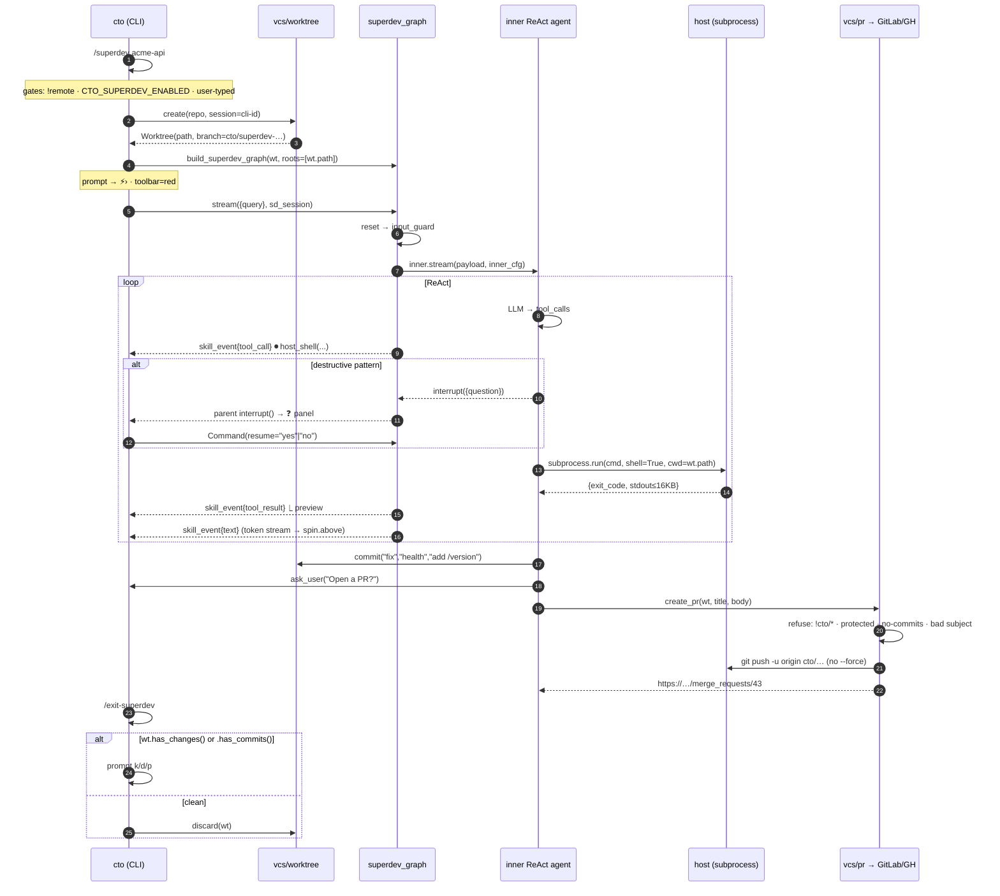

# Phase 8 — Code Mutation: worktree → PR

> CTO can now *write* code — but only ever onto a disposable git
> **worktree** branch that ships as a **PR for human review**.
> Two consumers of the same primitives: **`/superdev`**
> (interactive, host-trusted, local-only) and **skill
> remediation** (autonomous, container-bounded; `security-audit`
> Phase 11). The line moves from "never writes" → "writes via
> PR." Mode-switching is a *user* decision, never an LLM decision.

---

## 1. System

```mermaid
flowchart LR
    subgraph prim["src/rag/vcs/  (8-A · 8-B)"]
      WT["worktree.py<br/>create · attach · discard<br/>list_orphans · reap"]
      PR["pr.py<br/>create_pr · commit_all<br/>_PROTECTED_RE · _parse_remote"]
    end

    subgraph cli["api/cli.py"]
      SLASH["/superdev [repo]<br/>/superdev allow &lt;dir&gt;<br/>/exit-superdev"]
    end

    subgraph sd["8-C · superdev (2nd graph)"]
      SG["agents/superdev_graph.py<br/>START→reset→guard→loop→respond"]
      HT["agents/tools/host.py<br/>host_shell · host_read<br/>host_write · host_edit<br/>docker_run · ask_user<br/>commit · create_pr"]
      DET["DESTRUCTIVE regex list<br/>→ interrupt()"]
    end

    subgraph rem["8-D · skill remediation"]
      CFG["SandboxCfg.worktree: true"]
      DS["DockerSandbox.start<br/>(worktree=wt.path)"]
      RUN["skill_runner<br/>+ wt lifecycle"]
      SK[["security-audit.md<br/>Phase 11 + create_pr"]]
    end

    GH[("GitLab / GitHub<br/>MR · PR")]
    DISK[("data/superdev/&lt;sess&gt;/&lt;repo&gt;<br/>cto/&lt;prefix&gt;-&lt;ts&gt; branch")]
    SRC[("data/repos/&lt;repo&gt;<br/>HEAD · pristine")]

    SLASH ==>|user-typed only| SG
    SG --> HT --> DET
    HT -->|commit| WT
    HT -->|create_pr| PR
    CFG --> RUN --> DS
    RUN --> WT
    SK --> RUN
    RUN -->|build_skill_tools<br/>worktree=wt| PR
    WT -->|git worktree add -b| DISK
    WT -.shares .git.- SRC
    DS -->|"-v wt:/work:rw<br/>-v src:/repo:ro"| DISK
    PR -->|push -u + REST| GH

    classDef prim fill:#0d4f3c,color:#fff
    classDef hot  fill:#7a1f1f,color:#fff
    classDef file fill:#2d2d2d,color:#ddd,stroke:#555,stroke-dasharray:3
    class WT,PR prim
    class SG,HT,DET hot
    class DISK,SRC,GH,SK file
```

**Capability isolation is compile-time:** `agents/tools/__init__`
(the read-only graph's registry) does NOT import `host.py`;
`build_superdev_graph()` raises if `CTO_SUPERDEV_ENABLED=false`.
The two graphs share `AgentState`, the checkpointer, and
`input_guard` — nothing else.

---

## 2. `/superdev` — interactive flow



**Shell-only variant** (`/superdev` with no arg): `wt=None`,
`cwd=$PWD`, toolset = `host_shell · host_read · docker_run ·
ask_user`. No write/edit/commit/create_pr — there is no
throwaway branch, so the PR boundary doesn't exist. Destructive
gate stays. Use this for cloud-CLI / ops queries.

---

## 3. Skill remediation — autonomous flow (8-D)

```mermaid
sequenceDiagram
    autonumber
    participant G as parent graph
    participant SR as skill_runner
    participant WT as vcs/worktree
    participant D as Docker (cto-skill-*)
    participant A as inner skill agent
    participant PR as vcs/pr

    G->>SR: route=skill, name=security-audit
    SR->>WT: create(repo, prefix=skill, session=tid)
    SR->>D: start(repo, worktree=wt.path)
    Note right of D: -v wt.path:/work:rw<br/>-v repos/repo:/repo:ro<br/>(replaces /work tmpfs)
    SR->>A: stream({messages}, inner_cfg)
    Note over A: Phases 0–10: scan /repo (ro)<br/>write_report(append=True)
    A-->>G: interrupt(ask_user "Open fix PR? CRITICAL/CRIT+HIGH/skip")
    G-->>A: resume("CRITICAL only")
    loop per finding
      A->>D: exec(cid, "edit /work/<f>; git -C /work commit -m 'sec(<id>): …'")
      A->>D: exec(cid, "<build-cmd>")
      alt build fails
        A->>D: exec(cid, "git -C /work revert --no-edit HEAD")
      end
    end
    A->>PR: create_pr(wt, title, body=table)
    PR-->>A: URL
    SR->>D: stop(cid)
    alt wt.has_commits()
      Note over SR,WT: KEEP — branch IS the PR
    else
      SR->>WT: discard(wt)
    end
```

---

## 4. Threat-model split

| | Read-only graph (Phases 1–7) | `/superdev` (8-C) | Skill remediation (8-D) |
|---|---|---|---|
| **Where it runs** | server, over indexed repos | user's laptop only | server, container-bounded |
| **Who triggers** | any client | user-typed `/superdev` | router/slash → `ask_user` consent |
| **Shell** | `--network=none --read-only` Docker | `subprocess.run(shell=True)` on host | `docker exec` in persistent ctr |
| **Writes** | none (`/repo:ro`) | jailed to worktree + allowlist | jailed to `/work` bind-mount |
| **Net** | sandbox: off | host: inherited; docker_run: on | per-skill (`sandbox.network`) |
| **Creds** | none | inherits user's env (AWS/KUBE/…) | none (container env) |
| **Exit artifact** | answer + report | `cto/*` branch → PR or discard | `cto/*` branch → PR or discard |
| **Refused** | — | `--remote`, flag-off, server `/query` | no-repo, no-worktree |

---

## 5. What we deliberately did NOT build

- **LLM-chosen entry to superdev.** No router regex, no
  `match_skill`, no tool. Only the user's slash.
- **Server-side superdev.** Host-shell on a shared server is
  RCE-as-a-feature. `--remote` and `app.py /query` have no path
  to `superdev_graph`.
- **Auto-merge / push to protected / `--force`.** Refused inside
  `vcs/pr.py` (`_PROTECTED_RE`, `cto/*`-only, no force flag),
  not just discouraged in prompt.
- **`shell=True` without the destructive gate.** `DESTRUCTIVE`
  in `host.py` is the entire safety model for 8-C.
- **Cred sandboxing.** `host_shell` inherits the user's full
  env. That's the trade for "operator, not advisor." Use
  shell-only mode + `docker_run` if you want isolation; or add
  a narrow `aws_describe` tool to the read-only graph instead.

---

## 6. Files

| File | Adds |
|---|---|
| `src/rag/vcs/worktree.py` | `Worktree`, `create/attach/discard/list_orphans/reap` |
| `src/rag/vcs/pr.py` | `create_pr`, `commit_all`, `commit_message`, `_PROTECTED_RE`, host detect |
| `src/rag/agents/tools/host.py` | `build_host_tools(wt|None, roots)`, `detect_destructive`, `_jailed` |
| `src/rag/agents/superdev_graph.py` | second compiled graph, interrupt bridge, token relay |
| `src/rag/api/cli.py` | `/superdev [repo]`, `/superdev allow`, `/exit-superdev`, `⚡›`, red toolbar, `skill_event.text` |
| `src/rag/sandbox/docker.py` | `start(worktree=…)` → `-v wt:/work:rw` |
| `src/rag/skills/registry.py` | `SandboxCfg.worktree: bool` |
| `src/rag/skills/runner.py` | wt create/attach/discard around container; preamble; `reap_orphans` += worktrees |
| `src/rag/skills/tools.py` | `make_create_pr_tool(wt)`, `build_skill_tools(..., worktree=)` |
| `src/rag/agents/state.py` · `nodes/reset.py` | `skill_wt` |
| `src/rag/config.py` | `WORKTREES_DIR`, `CTO_SUPERDEV_ENABLED`, `GIT_TOKEN`, `GITLAB_URL`, `GITHUB_API` |
| `data/skills/security-audit.md` | `sandbox.worktree: true`, `tools_allowed: create_pr`, Phase 11 body |
| `tests/test_phase8.py` · `Makefile` | 33 checks; `make test-phase8`, `make worktree-reap` |
