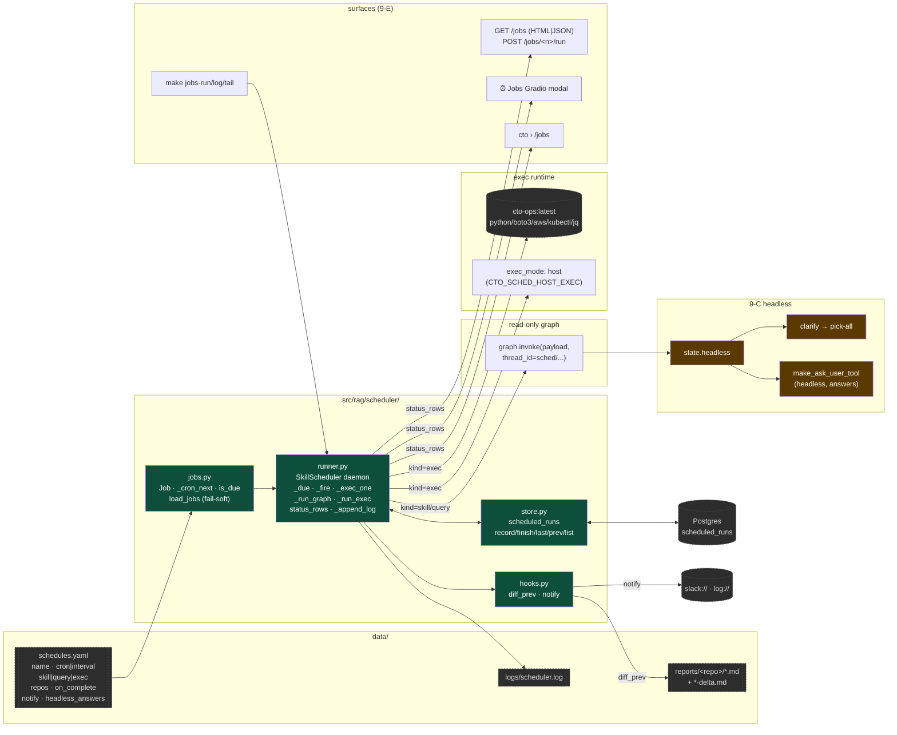
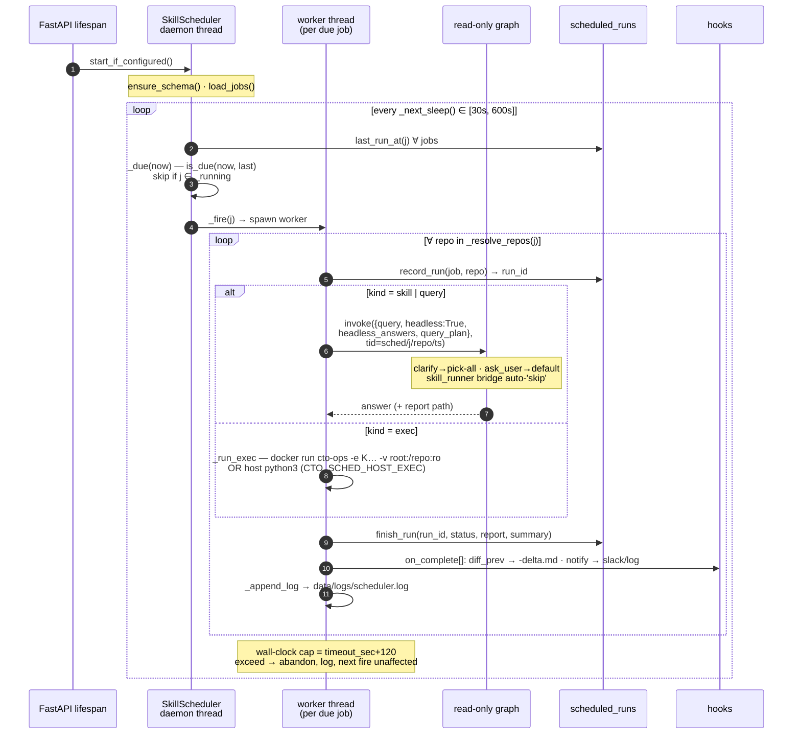

# Phase 9 — Task Scheduler: skills, queries, exec on a clock

> Run *anything CTO can do* on a schedule, with no human in the
> loop: nightly security audits that open fix-PRs (8-D),
> hourly questions, daily ops scripts. One daemon thread inside
> the FastAPI process, one Postgres table for run history,
> three job kinds (`skill` / `query` / `exec`), one headless
> degenerate for every interactive affordance.

---

## 1. System

---

## 2. Daemon tick

---

## 3. Headless degenerate (9-C)

| Interactive affordance | Headless behaviour |
|---|---|
| `clarify` (`interrupt()`) | auto-resolve: repo → ALL candidates; intent → broadest scope; kind tracked in `clarified` so the round-counter still works |
| `ask_user` (skill tool) | `make_ask_user_tool(headless=True, answers)` — longest-substring match against `headless_answers` keys, else `"skip"`. Never blocks. |
| `skill_runner` interrupt bridge | `Command(resume="skip")` instead of parent `interrupt()` |
| Semantic cache | bypassed (`use_cache=False` not needed — `_run_graph` doesn't call `cache_lookup`) |
| Wall-clock | `job.timeout_sec + 120` — worker abandons the inner thread; reaper handles the container/worktree on next restart |

---

## 4. Job kinds — capability boundary

| | `query:` | `skill:` | `exec:` |
|---|---|---|---|
| **LLM in loop** | yes (read-only graph) | yes (skill_runner) | **no** |
| **Shell** | none | `run_shell_command` **inside container** iff in `tools_allowed` | direct subprocess |
| **Creds** | none | `SandboxCfg.env_passthrough/mounts` → `-e K` / `-v src:dst:ro` | `env_passthrough` (allowlist) |
| **Host write** | none | `/work` (worktree if `sandbox.worktree`) | sandbox: none (`/repo:ro`); host: full |
| **Use for** | "any new CRITICAL findings?" | nightly secaudit + Phase-11 PR | git-pull-all-repos, EC2-cost-to-Slack |
| **Why not superdev** | §8 — host_shell on a server, headless, is RCE-as-a-feature. `exec:` runs *your* checked-in script (no LLM picks the argv); `skill:` runs LLM-chosen commands but container-bounded with allowlisted env. |

---

## 5. What we deliberately did NOT build

- **Distributed scheduling.** One process, one host. K8s CronJob /
  Temporal when you need multi-host, retries-with-backoff, DAGs.
- **Exactly-once.** Server restart mid-job → re-runs next fire.
  Reports are date-named/idempotent; `scheduled_runs` row stays
  `running` (visible in `/jobs`).
- **Job DAGs.** No "B after A succeeds." One job, one schedule.
- **Hot-reload of `schedules.yaml`.** Read once at lifespan
  start; restart to pick up changes. (`/jobs` HTML re-reads
  via `load_jobs()`, but the daemon's job list is fixed.)
- **Scheduled superdev.** Rejected — see §4.

---

## 6. Files

| File | Adds |
|---|---|
| `src/rag/scheduler/jobs.py` | `Job`, `_cron_next` (5-field, no dep), `is_due`/`next_fire`, `load_jobs` |
| `src/rag/scheduler/runner.py` | `SkillScheduler`, `_run_graph`/`_run_exec`/`_exec_one`, `run_job_now`, `status_rows`, `_append_log`, `start_if_configured` |
| `src/rag/scheduler/store.py` | `scheduled_runs` table, `record/finish/last/prev/list_runs` |
| `src/rag/scheduler/hooks.py` | `diff_prev` (difflib → `-delta.md`), `notify` (`slack://`, `log://`) |
| `src/rag/agents/state.py` · `nodes/clarify.py` | `headless`, `headless_answers`; clarify auto-pick-all (factored `_apply_answer`) |
| `src/rag/skills/tools.py` · `runner.py` | `make_ask_user_tool(headless, answers)`; threaded into `build_skill_tools`/`_agent_for`; bridge auto-`skip` |
| `src/rag/skills/registry.py` · `sandbox/docker.py` | `SandboxCfg.env_passthrough/mounts` → `start()` `-e`/`-v…:ro` |
| `src/rag/api/app.py` | lifespan; `GET /jobs` (HTML\|JSON, auto-refresh, ▶fire); `POST /jobs/{name}/run` |
| `src/rag/api/ui.py` | `⏰ Jobs` modal (Dataframe, fire-now, log accordion, ↗ full page) |
| `src/rag/api/cli.py` | `/jobs` panel |
| `sandbox/Dockerfile.ops` | `cto-ops` image (python/boto3/awscli/kubectl/jq) |
| `data/schedules.yaml.example` · `scripts/jobs/pull_repos.py` | reference config + reference `exec:` job |
| `tests/test_phase9.py` · `Makefile` | 29 checks; `test-phase9`, `jobs-run/log/tail`, `docker-ops` |
